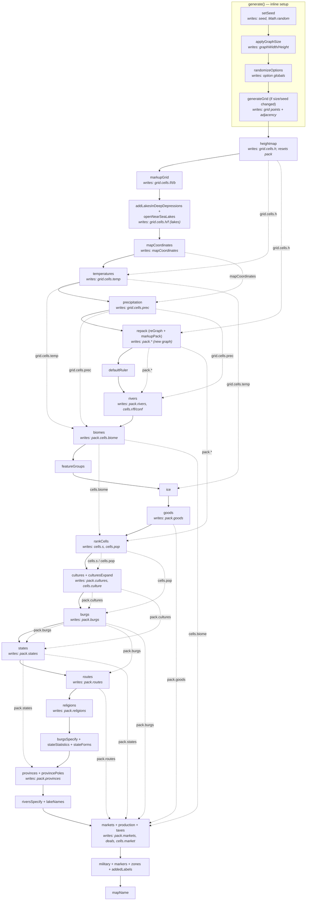
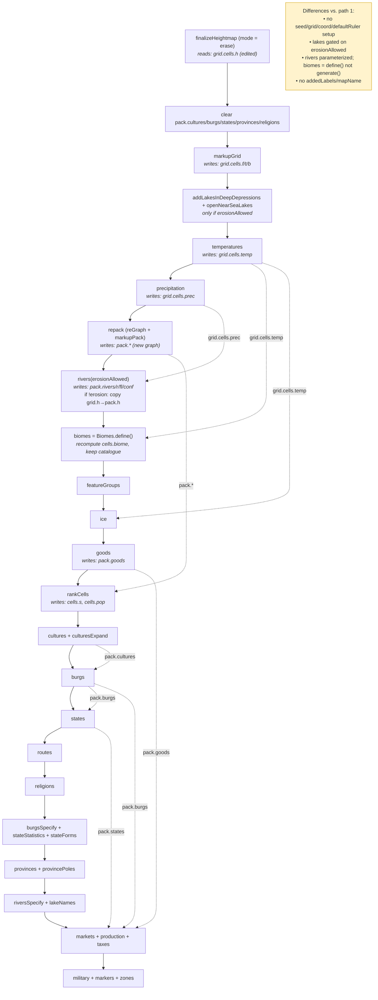
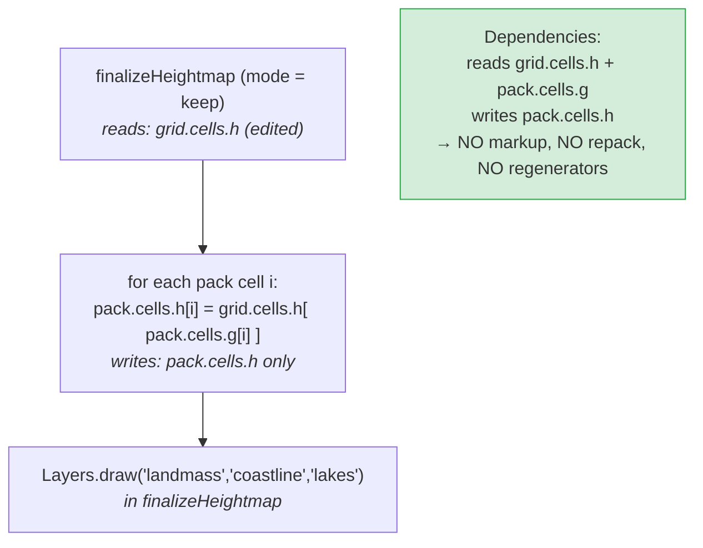
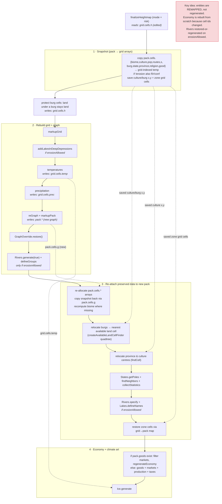

# Generation Paths & Their Global Dependencies

There are **four** ways the map is (re)built. All of them mutate the same two
global graphs — `grid` (the raw Voronoi/jittered-square grid) and `pack` (the
repacked graph everything downstream is indexed against) — plus a handful of
loose globals (`seed`, `Math.random`, `mapCoordinates`, the DOM option
inputs). Because the steps communicate almost entirely through these globals
rather than through arguments/return values, the *execution order is the
dependency graph*: a step "depends on" every earlier step that last wrote a
global it reads.

The diagrams below make that implicit coupling explicit. Each node lists the
globals a step **writes**; labelled dotted arrows show a global **flowing** to a
later, non-adjacent consumer (the immediate `next` step is assumed to consume
the previous one).

| # | Path | Entry point | What it does |
|---|------|-------------|--------------|
| 1 | **Full generate** | [`generate()`](../../public/main.js) → `GenerationPipeline.run()` | Build a world from scratch. Source of truth. |
| 2 | **Erase** | [`regenerateErasedData()`](../../src/controllers/heightmap-editor.ts) → `createErasePipeline().runFrom("markupGrid")` | After heightmap edit: throw away all settlement data, re-run phases 3→15. |
| 3 | **Keep** | [`restoreKeptData()`](../../src/controllers/heightmap-editor.ts) | After heightmap edit: copy edited heights into `pack`, regenerate nothing. |
| 4 | **Risk** | [`restoreRiskedData()`](../../src/controllers/heightmap-editor.ts) | After heightmap edit: rebuild the graph, then *remap* preserved entities onto it. |

> Sources: [`public/main.js`](../../public/main.js) `generate()`,
> [`src/generators/generation-pipeline.ts`](../../src/generators/generation-pipeline.ts),
> [`src/controllers/heightmap-editor.ts`](../../src/controllers/heightmap-editor.ts) `finalizeHeightmap()`.
> See also the phase table in [`docs/domain/generation_pipeline.md`](../domain/generation_pipeline.md).

## Global-state legend

| Global | Written by | Notes |
|--------|-----------|-------|
| `seed`, `Math.random` | `setSeed` | Every stochastic step reads `Math.random` implicitly — omitted from edges to avoid clutter. |
| `grid` (points, adjacency) | `generateGrid` | Rebuilt only when the grid size/seed changed. |
| `grid.cells.h` | `heightmap` / heightmap editor | The heightmap. Root dependency of everything. |
| `grid.cells.f/t/b` | `markupGrid` | Feature ids, distance-to-coast type, border flags. |
| `grid.cells.temp` | `temperatures` | |
| `grid.cells.prec` | `precipitation` | |
| `mapCoordinates` | `mapCoordinates` | Latitude band; drives temperature & precipitation. |
| `pack` (whole graph) | `repack` (`reGraph` + `markupPack`) | Repacked cells; **invalidates every pre-repack `pack.cells.*` index.** |
| `pack.cells.r/fl/conf`, `pack.rivers` | `rivers` | |
| `pack.cells.biome` | `biomes` | |
| `pack.cells.s`, `pack.cells.pop` | `rankCells` | Suitability & population. |
| `pack.cultures` | `cultures` / `culturesExpand` | |
| `pack.burgs` | `burgs` / `burgsSpecify` | |
| `pack.states` | `states` / `stateForms` / `stateStatistics` | |
| `pack.provinces` | `provinces` | |
| `pack.routes` | `routes` | |
| `pack.religions` | `religions` | |
| `pack.goods` | `goods` | Map-independent catalogue. |
| `pack.markets`, `pack.deals`, `cells.market` | `markets` / `production` | Economy. |

---

## 1. Full generate (`generate()` → `GenerationPipeline`)

The canonical sequence. Pre-pipeline setup runs inline in `generate()`; the
rest is [`GenerationPipeline`](../../src/generators/generation-pipeline.ts).

---

## 2. Erase (`regenerateErasedData()` → `createErasePipeline`)

Clears `pack.cultures/burgs/states/provinces/religions`, then runs the *same*
sequence as path 1 **from `markupGrid` onward** — the heightmap is the freshly
edited `grid.cells.h`, and grid/seed/coordinates are untouched. It is a "second
generate" that skips only the seed/grid/coordinate/default-ruler setup. The
`erosionAllowed` flag toggles a few branches.

---

## 3. Keep (`restoreKeptData()`)

The minimal path. The graph is **not** rebuilt, so no cell reclassification is
possible ("you won't be able to change the coastline"). It only copies the
edited grid heights down into the existing `pack` cells, via the persistent
`pack.cells.g` (pack→grid) mapping. Every other `pack.*` array is left exactly
as it was. The visible refresh (landmass/coastline/lakes layers) happens back in
`finalizeHeightmap`.

---

## 4. Risk (`restoreRiskedData()`)

The most intricate path: it **rebuilds the graph** (so the coastline can change)
but tries to **preserve** the existing settlement entities by projecting them
onto the new pack. It first snapshots every per-cell array indexed by *grid*
cell (surviving the repack), re-runs hydrology/climate, calls `reGraph`, then
re-attaches the saved data and re-locates each entity's centre in the new pack.
`erosionAllowed` decides whether rivers are regenerated or restored from the
snapshot.

---

## Cross-path comparison

| Concern | 1 Full | 2 Erase | 3 Keep | 4 Risk |
|---------|--------|---------|--------|--------|
| `setSeed` / `generateGrid` | ✅ | ❌ | ❌ | ❌ |
| `markupGrid` (grid reclassified) | ✅ | ✅ | ❌ | ✅ |
| `reGraph` (pack rebuilt) | ✅ | ✅ | ❌ | ✅ |
| Rivers | generate | generate/param | keep | generate *or* restore |
| Biomes | `generate` (new catalogue) | `define` (reuse catalogue) | keep | recompute per-cell |
| Cultures/Burgs/States/… | generate | generate | **keep** | **remap preserved** |
| Economy | generate | generate | keep | rebuild (cells changed) |
| Coastline can change | ✅ | ✅ | ❌ | ✅ |
