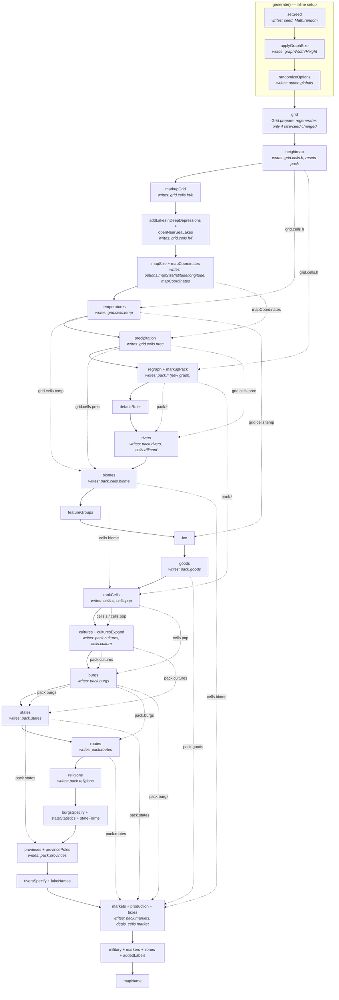

# Generation Pipeline

Building a world is one long, strictly ordered sequence of generator calls. The generators talk to
each other almost entirely through the two shared globals — `grid` (the raw jittered-square graph,
typed as [`GridGraph`](../../src/types/GridGraph.ts)) and `pack` (the repacked graph everything
downstream is indexed against) — so **the execution order _is_ the dependency graph**: a step depends
on every earlier step that last wrote a global it reads.

That order used to live as a hardcoded call list in `generate()`, retyped by hand at every site that
rebuilds part of a map. It is now declared once, as data:

| File                                                                                                          | Role                                                                                               |
| ------------------------------------------------------------------------------------------------------------- | -------------------------------------------------------------------------------------------------- |
| [`src/generators/pipeline.ts`](../../src/generators/pipeline.ts)                                              | The runner. Generic, knows nothing about generators, `pack` or `grid`                              |
| [`src/generators/grid-generator.ts`](../../src/generators/grid-generator.ts)                                  | The `Grid` module and its siblings `Temperature`, `Precipitation` and `Pack` (see below)           |
| [`src/generators/generation-pipeline.ts`](../../src/generators/generation-pipeline.ts)                        | The configuration: `GenerationPipeline` and `ErasePipeline` step lists                             |
| [`public/main.js`](../../public/main.js) → `generate()`                                                       | Drives `GenerationPipeline` and owns everything around it (seed, sizing, statistics, error dialog) |
| [`src/controllers/heightmap-editor.ts`](../../src/controllers/heightmap-editor.ts) → `regenerateErasedData()` | Drives `ErasePipeline`                                                                             |

## The runner

```ts
interface PipelineStep<Id extends string = string, TContext = void> {
  id: Id;
  run: (context: TContext) => unknown;
}

new Pipeline<Id, TContext>(name, steps).run(context): Promise<void>;
```

- **Registration order is the execution order** — the same rule `mapLayers`/`Layers` uses for z-order.
  `run()` iterates the array, nothing is computed or reordered behind it.
- **Steps may be async.** A step's return value is awaited, so `heightmap` (the only async step today)
  works the same as the sync ones without forcing anything else to become async.
- **Per-call parameters arrive through `context`**, not through closure state — see `GenerationContext`
  and `EraseContext`. A step that behaves differently between paths reads a flag off the context
  instead of being conditionally omitted from the list.
- **Logging and timing belong to the runner.** Each run is an `INFO`-gated `console.group(name)` with a
  `TIME`-gated timer per step id. Generators no longer time themselves at the top level; the timers
  that remain inside them (`expandStates`, `generateTrails`, `calculateVoronoi`, …) are sub-phase
  detail nested under their step.
- **Failures name the phase.** A throwing step is rethrown as
  `` `${pipelineName} failed at step "${id}": ${reason}` `` with the original error as `cause`.
  [`parseError`](../../src/utils/commonUtils.ts) walks the `cause` chain, so the generation error
  dialog shows both the phase and the underlying stack.

There is deliberately no declared dependency graph. An earlier design gave each step a `dependsOn`
list; in practice it always named the immediately preceding step — the real sequence has never been
anything but a straight line — so it added validation logic and API surface without doing any work.

## `GenerationPipeline` — build a world from scratch

`generate(options)` in `main.js` resolves what the pipeline doesn't own (`setSeed`, `applyGraphSize`,
`randomizeOptions`), calls `await GenerationPipeline.run({seed, graph})`, then reports (`logStats`,
`TOTAL` timing) or shows the generation error dialog. The pipeline is exposed as
`window.GenerationPipeline` because `main.js` is a classic script.

| Phase                    | Step ids                                                      | Writes (selection)                                                              |
| ------------------------ | ------------------------------------------------------------- | ------------------------------------------------------------------------------- |
| Grid + heightmap         | `grid`, `heightmap`                                           | `grid`, `grid.cells.h`; resets `pack`                                           |
| Hydrology base           | `markupGrid`, `depressionLakes`, `nearSeaLakes`               | `grid.cells.f/t/b`, lake and ocean topology                                     |
| World position & climate | `mapSize`, `mapCoordinates`, `temperatures`, `precipitation`  | `options.mapSize/latitude/longitude`, `mapCoordinates`, `grid.cells.temp/prec`  |
| Repack                   | `regraph`, `markupPack`, `defaultRuler`                       | `pack.cells.*` (**invalidates every earlier `pack` cell index**), default ruler |
| Rivers & biomes          | `rivers`, `biomes`, `featureGroups`                           | `pack.rivers`, `cells.r/fl/conf`, `pack.biomes`, `cells.biome`                  |
| Climate art              | `ice`                                                         | `pack.ice`                                                                      |
| Goods catalogue          | `goods`                                                       | `pack.goods` (map-independent), `cells.good`                                    |
| Ranking & cultures       | `rankCells`, `cultures`, `culturesExpand`                     | `cells.s`, `cells.pop`, `pack.cultures`, `cells.culture`                        |
| Settlement & politics    | `burgs`, `states`, `routes`, `religions`                      | `pack.burgs`, `pack.states`, `pack.routes`, `pack.religions`                    |
| Specification            | `burgsSpecify`, `stateStatistics`, `stateForms`               | burg types, state stats and forms                                               |
| Provinces                | `provinces`, `provincePoles`                                  | `pack.provinces`                                                                |
| Naming polish            | `riversSpecify`, `lakeNames`                                  | river and lake names                                                            |
| Economy                  | `markets`, `production`, `taxes`                              | `pack.markets`, `cells.market`, `pack.deals`, burg/state treasuries             |
| Overlays                 | `military`, `markers`, `zones`, `addedLabels`                 | regiments, markers, zones, labels                                               |
| Finalise                 | `mapName`                                                     | map name                                                                        |

Two constraints are easy to break when replicating a slice of this:

- **Goods depend on nothing pack-side** but must exist before `markets`. `Goods.generate()` keeps an
  existing catalogue (it restores the defaults only when `pack.goods` is empty) and places bonus goods
  on the cells; `Goods.regenerate()` reshuffles that placement with a fresh random seed.
- **Economy depends on the whole settlement chain.** Production reads `state.culture`,
  `state.provinces`, `cells.biome`, `cells.pop`, `cells.market` and `pack.routes`. Anything that
  rebuilds burgs, states or provinces must rebuild the economy too, or markets, deals and treasuries
  reference stale or removed entities. See [`production_schema.md`](../domain/production_schema.md)
  and [`trade_schema.md`](../domain/trade_schema.md).



## `ErasePipeline` — heightmap edited, everything downstream regenerated

Exiting the heightmap editor in **erase** mode clears `pack.cultures/burgs/states/provinces/religions`
and runs `ErasePipeline.run({erosion})`. It is a second generate over the freshly edited
`grid.cells.h`: the same steps, in the same order, from `markupGrid` to `zones`.

It is a separate list, not a slice of `GenerationPipeline` — the ids are typed as `PipelineStepId`, so
a step id that does not exist in the canonical list is a compile error, but the two lists are kept in
sync by hand. Differences, all deliberate:

- **Dropped:** `grid`, `heightmap` (the user just edited the heights), `mapSize`, `mapCoordinates`
  and `defaultRuler` (map bounds don't change on an edit), `addedLabels` and `mapName` (not touched).
- **`erosion` context:** `addLakesInDeepDepressions` and `openNearSeaLakes` run only when erosion is
  allowed; `rivers` calls `Rivers.generate(erosion)` and, when it isn't, snaps `pack.cells.h` back to
  the grid heights wherever the land/water side didn't flip.
- **`biomes` calls `Biomes.define()`**, recomputing `cells.biome` against the existing catalogue
  instead of resetting `pack.biomes`.
- Redrawing is not part of the pipeline: `finalizeHeightmap()` draws `ocean`, `landmass`, `lakes` and
  `coastline` after the mode handler returns, for all three modes.

## Paths that are not pipelines

Three other places rebuild a large slice of a map by hand. They are not (yet) expressed as pipelines,
and each one is a site that can silently fall behind when a generation step is added.

| Concern                       | Full generate              | Erase                      | [Keep](../../src/controllers/heightmap-editor.ts) | [Risk](../../src/controllers/heightmap-editor.ts) | [Resample](../../src/generators/resample.ts)      |
| ----------------------------- | -------------------------- | -------------------------- | ------------------------------------------------- | ------------------------------------------------- | ------------------------------------------------- |
| Driver                        | `GenerationPipeline`       | `ErasePipeline`            | `restoreKeptData()`                               | `restoreRiskedData()`                             | `Resampler.process()`                             |
| Grid rebuilt                  | ✅                         | ❌                         | ❌                                                | ❌                                                | ✅ (new dimensions)                               |
| `markupGrid`                  | ✅                         | ✅                         | ❌                                                | ✅                                                | ✅                                                |
| `regraph` (pack rebuilt)      | ✅                         | ✅                         | ❌                                                | ✅                                                | ✅                                                |
| Rivers                        | generate                   | generate (parameterized)   | keep                                              | generate _or_ restore                             | restored from parent meanders                     |
| Biomes                        | `generate` (new catalogue) | `define` (reuse catalogue) | keep                                              | recompute where missing                           | restored per cell                                 |
| Cultures / burgs / states / … | generate                   | generate                   | keep                                              | **remap onto the new pack**                       | restored from parent                              |
| Economy                       | generate                   | generate                   | keep                                              | rebuild (cell ids changed)                        | rebuild (`restoreEconomy` + `Production.produce`) |
| Coastline can change          | ✅                         | ✅                         | ❌                                                | ✅                                                | ✅                                                |

- **Keep** is the minimal path: it copies edited grid heights into the existing pack cells via
  `pack.cells.g` and touches nothing else, which is why the coastline cannot change.
- **Risk** rebuilds the graph but _preserves entities_: it snapshots every per-cell array against grid
  indices, re-runs hydrology/climate/repack, calls `GraphOverride.restore()`, then re-attaches the
  snapshot and re-locates each burg, culture and province centre in the new pack. The economy is
  rebuilt because cell ids no longer match.
- **Resample** (transform and submap tools) generates a fresh grid for the target size, resamples
  height/temp/prec from the parent by inverse projection, re-runs `markupGrid` → `markupPack` → `ice`
  → `defaultRuler`, then restores cells, entities and notes from the parent. Only the map-independent
  parts of the economy survive: the goods catalogue and market anchors are carried over, territories
  are re-flooded via `Markets.expandTerritories`, and `Production.produce()` is re-run.

Partial regenerations triggered from the UI (`regenerate` methods on the generator modules,
[`auto-update.ts`](../../src/services/io/auto-update.ts) migrations,
[`world-configurator.ts`](../../src/controllers/world-configurator.ts) → `updateWorld`) do not
replicate the pipeline, but they belong to the same dependency graph — check whether their scope
reaches a phase you change.

## Adding a new generation step

1. Add a `{id, run}` entry to `pipelineSteps` in `generation-pipeline.ts`, at the correct phase
   boundary. `generate()` in `main.js` does not sequence generator calls any more.
2. If the step runs **after `regraph`**, add it to `erasePipelineSteps` at the matching boundary —
   otherwise the feature is missing from every map that went through the heightmap editor.
3. If the step's output is cell-indexed or belongs to an entity the risk path re-maps, handle it in
   `restoreRiskedData()`.
4. For `resample.ts`: per-cell arrays go into `restoreCellData` (parent-quadtree mapping);
   entity-keyed lists go into `restoreEconomy` (or a sibling) with a validity filter for removed
   entities. Call the generator directly only when the output cannot be recovered from the parent —
   and prefer a partial method (cf. `Markets.expandTerritories`) over a full regeneration.
5. Add a version-bump migration in [`auto-update.ts`](../../src/services/io/auto-update.ts) so older
   saves gain the new fields on load.
6. Update the phase table above.

## The grid modules

Everything that builds or reads the raw graph lives in five sibling modules, each reachable as a
global the same way `Features`, `Rivers` and the other generators are:

### `Grid` — [`grid-generator.ts`](../../src/generators/grid-generator.ts)

| Method                                                       | Role                                                                 |
| ------------------------------------------------------------ | -------------------------------------------------------------------- |
| `generate(seed, width, height)`                              | jittered points, boundary and Voronoi diagram for a fresh graph      |
| `shouldRegenerate(graph, expectedSeed, width, height)`       | does the graph still fit the requested seed and canvas size?         |
| `prepare(expectedSeed?, precreated?)`                        | the `grid` pipeline step: reuse the current graph or build a new one |
| `rebuildGraph(graph)`                                        | restore cells and vertices of a saved graph from its points          |
| `resetHeights(graph)`                                        | blank the heightmap, keeping the graph                               |
| `getCellsDesired()`                                          | the cell count requested in the options                              |
| `findCell(x, y)` / `findAll(x, y, radius)` / `getPolygon(id)` | lookups on the regular square grid; all take an optional graph       |
| `addDeepDepressionLakes()` / `openNearSeaLakes()`            | lake topology over `grid.cells.h/t/f` and `grid.features`            |

### `Temperature` — [`temperature-generator.ts`](../../src/generators/temperature-generator.ts)

`generate()` fills `grid.cells.temp` from each row's latitude and each cell's altitude.

### `Precipitation` — [`precipitation-generator.ts`](../../src/generators/precipitation-generator.ts)

`generate()` passes the winds over the cells, filling `grid.cells.prec`. `getWinds()` returns the
bands they enter through; it is free of randomness — derived from `options.winds` and the map
position — so [`drawPrecipitation`](../../src/renderers/draw-precipitation.ts) calls it to draw the
wind arrows whenever the layer is rendered. The generators never touch the DOM.

### `Coordinates` — [`coordinates.ts`](../../src/generators/coordinates.ts)

`defineMapSize()` is the `mapSize` step: it picks how much of the globe the map covers and where it
sits, from the heightmap template (real-world templates have fixed values, random ones a
distribution) unless the option is locked. `calculate()` is the `mapCoordinates` step: it turns
`options.mapSize/latitude/longitude` and the canvas aspect ratio into the `mapCoordinates` lat/lon
box every latitude-dependent generator and renderer reads.

### `Pack` — [`pack-generator.ts`](../../src/generators/pack-generator.ts)

`generate()` is the `regraph` step: it repacks the grid into `pack`, dropping deep ocean points and
splitting coastal cells so the packed graph is denser exactly where the map needs it.

It also owns the spatial lookups against the packed graph, mirroring `Grid`'s: `findCell(x, y, radius?)`
and `findAll(x, y, radius)` (both backed by one cached quadtree per graph, rebuilt when the cell points
are replaced) and `getPolygon(cellId)`. Each takes an optional graph, defaulting to the global `pack`.

## `Population` — [`population-generator.ts`](../../src/generators/population-generator.ts)

`rankCells()` is the `rankCells` step: it scores every land cell — biome habitability, river flux,
elevation, what it is coastal to and the goods around it — into `cells.s`, then turns that score into
rural population in `cells.pop`. Everything placed by population (cultures, burgs, states) reads it,
so it has to run after `biomes` and `goods` and before `cultures`.

Unlike the grid modules it is imported rather than global, and it runs outside the pipeline too:
`Burgs.regenerate()` and `Population.regenerate()` re-rank the cells before replacing burgs.
