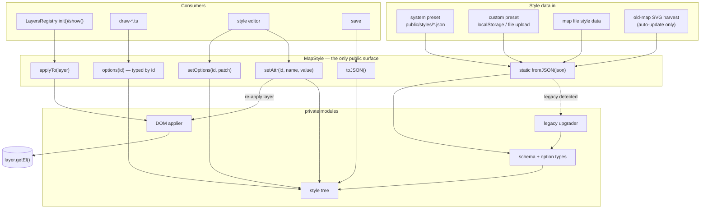

# Style store

## Problem

Layer styling lives as attributes on SVG groups. Three costs, all growing with the layers registry:

1. The registry's erase-on-hide model is only safe for state something else owns, so layers whose groups carry style edits or user-created sub-groups need hand-written `erase` overrides (`removeRoutes`, `removePrecipitation`, `removeBurgIcons`) to avoid deleting them. Each is a per-layer exception that exists only because the DOM is both the render target and the database.
2. Renderers make decisions by reading attributes back (`+coordinates.attr("data-size")`, halo `data-width`, heightmap `scheme`), so a layer that is off — no element — cannot even be reasoned about, and every read is stringly-typed.
3. Style persistence rides inside the serialized SVG, so styles cannot be read, validated or migrated without instantiating the whole document.

## Proposal

One class owns all style state. Everything else — node tree, schema, legacy formats, DOM writing — is a private module of `src/styles/` that nothing outside the folder may import.



## Data

Keyed by registry layer id, children by the registry's declared children. Two kinds of values per node: `attrs` are raw SVG presentation attributes (open bag, applied verbatim, `null` = remove — never renamed, never migrated); `options` are typed inputs to renderer logic (never written to the DOM).

```json
{
  "routes": {
    "attrs": { "opacity": 0.9, "mask": "url(#land)" },
    "children": {
      "roads": { "attrs": { "stroke": "#d06324", "stroke-width": 0.7 } },
      "searoutes": { "attrs": { "stroke": "#ffffff", "stroke-dasharray": "1 0.5" } }
    }
  },
  "coordinates": { "attrs": { "stroke": "#d4d4d4" }, "options": { "fontSize": 12 } },
  "heightmap": {
    "children": {
      "landHeights": { "options": { "scheme": "bright", "terracing": 0, "skip": 5 } }
    }
  }
}
```

A style change never regenerates data: anything that would (relief density) lives in `options`, the app options object, not here.

## Public API

```ts
class MapStyle {
  /** validates; recognizes and upgrades pre-1.14x selector-keyed presets internally */
  static fromJSON(json: unknown): MapStyle;

  /** single serializer: map file style data and preset download */
  toJSON(): StyleData;

  /** write attrs onto layer.getEl() and its declared children; no-op cost when the layer has no content */
  applyTo(layer: Layer): void;

  /** typed by id — no call-site generics */
  options<Id extends StyledId>(id: Id): LayerOptionsFor<Id>;

  setAttr(id: StyledId, name: string, value: string | number | null): void;
  setOptions<Id extends StyledId>(id: Id, patch: Partial<LayerOptionsFor<Id>>): void;
}
```

`StyledId` is the registry `LayerId` plus child paths as literals: `"routes"`, `"routes/roads"`, `"heightmap/landHeights"`. Child paths kill the varargs-and-generics accessors of the first attempt and make a typo a compile error.

Type inference comes from one declaration map, so option reads need no annotation and get autocomplete:

```ts
interface LayerOptions {
  coordinates: { fontSize?: number };
  markers: { rescale?: number };
  "regions/statesHalo": { width?: number };
  "heightmap/landHeights": { scheme?: string; terracing?: number; skip?: number };
  // ...
}
type LayerOptionsFor<Id> = Id extends keyof LayerOptions ? LayerOptions[Id] : Record<string, never>;

mapStyle.options("markers").rescale;        // number | undefined
mapStyle.options("markers").resscale;       // compile error
```

## Consumers

Registry — one call, two sites. `applyTo` is what makes the uniform erase safe: the DOM stops being the only owner of styling, so `eraseContent()` may delete anything and re-show restores it — and the hand-written `erase` overrides protecting style state become deletable.

```ts
// LayersRegistry.init(), after ensuring the group and its children exist
mapStyle.applyTo(layer);          // replaces the static attrs bag on LayerParams
// LayersRegistry.show(), before draw(layer)
mapStyle.applyTo(layer);
```

Renderers — read options, never attributes:

```ts
// draw-coordinates.ts, before
const desiredSize = +coordinates.attr("data-size");
// after
const desiredSize = mapStyle.options("coordinates").fontSize ?? 12;
```

Every option read states its default at the use site — presets are allowed to omit keys, and applying a preset replaces the whole style, so "the previous preset's value is still on the DOM" no longer exists as a fallback.

Editor — two write paths:

```ts
mapStyle.setAttr("routes/roads", "stroke", "#803a2b");   // re-applies the routes layer
mapStyle.setOptions("coordinates", { fontSize: 14 });    // caller redraws: Layers.draw("coordinates")
```

Save/load and presets — `toJSON` on save and preset download; `fromJSON` on load, preset apply and upload. Old maps: auto-update scrapes the legacy SVG attributes into a legacy-preset-shaped object and feeds it to `fromJSON` like any other legacy input; no legacy symbol is visible outside `src/styles/`.

## Validation

Runtime-validate everything `fromJSON` accepts (users upload outdated presets; map files carry years-old data). Unknown attrs pass through — they are the open bag. Unknown option keys and unknown layer ids are dropped with a console warning, never a hard failure. Zod fits (types derive from the schema, one source of truth) and is a new dependency to sanction — or a hand-rolled validator if a dependency is unwanted; the API above does not change either way.

## Migration steps

Each lands green on its own; steps 3-5 can each split further per layer group.

1. `src/styles/` with `MapStyle`, schema, applier; registry calls `applyTo` in `init()`/`show()`; presentation attrs of current presets move to the new format; the static `attrs` bags on layer entries fold in. DOM output identical before/after.
2. Persistence: style data becomes its own record in the map file; load applies it over the restored SVG; auto-update harvests older maps.
3. Options, per consumer: each `data-*`/decision attribute moves into `LayerOptions`, its renderer read and its editor input migrate together, the attribute stops being written.
4. Style editor reads/writes through the facade.
5. Legacy style objects (`style.labels.groups`, `style.burgIcons`, …) re-home and disappear.

## Non-goals

Layer materialization and visibility (registry owns it); naming custom heightmap schemes; any preset visual retuning; TS migration of style.js beyond the reads/writes it needs.
