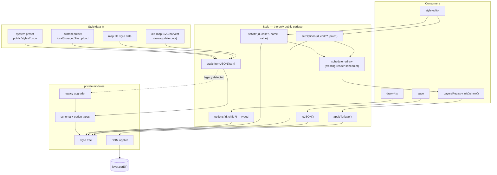

# Style store

## Problem

Layer styling lives as attributes on SVG groups. Three costs, all growing with the layers registry:

1. The registry's erase-on-hide model is only safe for state something else owns, so layers whose groups carry style edits or user-created sub-groups need hand-written `erase` overrides (`removeRoutes`, `removePrecipitation`, `removeBurgIcons`) to avoid deleting them. Each is a per-layer exception that exists only because the DOM is both the render target and the database.
2. Renderers make decisions by reading attributes back (`+coordinates.attr("data-size")`, halo `data-width`, heightmap `scheme`), so a layer that is off — no element — cannot even be reasoned about, and every read is stringly-typed.
3. Style persistence rides inside the serialized SVG, so styles cannot be read, validated or migrated without instantiating the whole document.

## Proposal

One class owns all style state. Everything else — node tree, schema, legacy formats, DOM writing — is a private module of `src/styles/` that nothing outside the folder may import. The single live instance replaces the current `style` global (and the legacy `Style` interface in `src/types/style.ts` retires with it).



## Data

Keyed by registry layer id; children by the layer's declared children. Two kinds of values per node, both typed: `attrs` are SVG presentation attributes from one shared `Attrs` interface (~18 paint attributes — the full vocabulary the 12 presets actually use; `null` = remove); `options` are per-layer inputs to renderer logic (never written to the DOM).

```json
{
  "routes": {
    "attrs": { "opacity": 0.9, "mask": "url(#land)" },
    "children": {
      "roads": { "attrs": { "stroke": "#d06324", "stroke-width": 0.7 } },
      "searoutes": { "attrs": { "stroke": "#ffffff", "stroke-dasharray": "1 0.5" } }
    }
  },
  "coordinates": { "attrs": { "stroke": "#d4d4d4" }, "options": { "fontSize": 12 } },
  "heightmap": {
    "children": {
      "landHeights": { "options": { "scheme": "bright", "terracing": 0, "skip": 5 } }
    }
  }
}
```

A style change never regenerates data: anything that would (relief density) lives in `options`, the app options object, not here.

## Public API

```ts
class Style {
  /** validates; recognizes and upgrades old selector-keyed presets internally */
  static fromJSON(json: unknown): Style;

  /** single serializer: map file style data and preset download */
  toJSON(): StyleData;

  /** write attrs onto layer.getEl() and its declared children; cheap no-op when the layer has no content */
  applyTo(layer: Layer): void;

  options<Id extends LayerId>(id: Id): LayerOptions[Id];
  options<Id extends LayerId, C extends ChildId<Id>>(id: Id, child: C): ChildOptions[Id][C];

  setAttr<K extends keyof Attrs>(id: LayerId, name: K, value: Attrs[K] | null): void;
  setAttr<Id extends LayerId, K extends keyof Attrs>(id: Id, child: ChildId<Id>, name: K, value: Attrs[K] | null): void;

  setOptions<Id extends LayerId>(id: Id, patch: Partial<LayerOptions[Id]>): void;
  setOptions<Id extends LayerId, C extends ChildId<Id>>(id: Id, child: C, patch: Partial<ChildOptions[Id][C]>): void;
}
```

Layer and child are separate, registry-typed parameters — no compound string ids. Attribute names and values are typed by one shared interface; options come from two declaration maps. Reads need no annotation, and a typo in any parameter is a compile error:

```ts
interface Attrs {
  opacity?: number;
  fill?: string;
  stroke?: string;
  "stroke-width"?: number;
  "stroke-dasharray"?: string;
  filter?: string;
  mask?: string;
  "font-size"?: number | string;
  "font-family"?: string;
  // ...the full set is ~18 fields: every paint attribute the presets use
}
interface LayerOptions {
  coordinates: { fontSize?: number };
  markers: { rescale?: number };
}
interface ChildOptions {
  regions: { statesHalo: { width?: number } };
  heightmap: { landHeights: HeightsOptions; oceanHeights: HeightsOptions };
}
type ChildId<Id> = Id extends keyof ChildOptions ? keyof ChildOptions[Id] : never;

style.options("markers").rescale;                   // number | undefined
style.options("heightmap", "landHeights").scheme;   // string | undefined
style.options("heightmap", "landHights");           // compile error
```

## How it is used

Generation and load both end in the same two steps: build the instance, let the registry apply it.

```ts
// boot / preset switch (style-presets):
style = Style.fromJSON(presetJson);       // system, localStorage or uploaded preset — legacy or current
// map load (load.ts):
style = Style.fromJSON(mapStyleData);     // own record in the map file; auto-update feeds harvested
                                          // legacy SVG attrs through the same call for old maps
```

Registry — one call, two sites. `applyTo` is what makes the uniform erase safe: the DOM stops being the only owner of styling, so `eraseContent()` may delete anything and re-show restores it — and the hand-written `erase` overrides protecting style state become deletable.

```ts
// LayersRegistry.init(), after ensuring the group and its declared children exist
style.applyTo(layer);          // replaces the static attrs bag on LayerParams
// inside the registry's redraw, before draw(layer)
style.applyTo(layer);
```

Renderers — read options, never attributes:

```ts
// draw-coordinates.ts, before
const desiredSize = +coordinates.attr("data-size");
// after
const desiredSize = style.options("coordinates").fontSize ?? 12;
```

Every option read states its default at the use site — presets may omit keys, and applying a preset replaces the whole style, so "the previous preset's value is still on the DOM" no longer exists as a fallback.

Editor — one rule, both setters: mutate, then a redraw of the affected layer is scheduled through the existing render scheduler (frame-coalesced, so slider drags render at frame rate on SVG and WebGL alike). Callers never think about invalidation:

```ts
style.setAttr("routes", "roads", "stroke", "#803a2b");
style.setOptions("coordinates", { fontSize: 14 });
```

Save and preset download — one serializer:

```ts
mapData.style = JSON.stringify(style.toJSON());          // save.ts
downloadFile(JSON.stringify(style.toJSON()), name);      // style saver
```

## Validation

Runtime-validate everything `fromJSON` accepts (users upload outdated presets; map files carry years-old data). The whole document is schema-covered: unknown attrs, unknown option keys and unknown layer ids are dropped with a console warning, never a hard failure. Zod fits (types derive from the schema, one source of truth) and is a new dependency to sanction — or a hand-rolled validator if a dependency is unwanted; the API above does not change either way.

## Out of scope here

Migration from the current attribute-based styling (sequencing, auto-update details, preset conversion) is specified separately once this design is agreed. Per-layer narrowing of `Attrs` (which paint attributes each layer may carry) is deliberate later polish — the shared interface is already fully typed and validated. Layer materialization and visibility stay with the registry. Naming custom heightmap schemes and preset visual retuning are unrelated.
