# Azgaar's Fantasy Map Generator v1.124.0: Economy

This is the biggest update in a while: your maps now have an **economy** simulated. Burgs produce and manufacture **goods**, regional **markets** set prices and move surpluses
around, **trade** flows are animated across the map, **states** collect taxes into a treasury, and **rivers** finally carry boats inland.

Everything is generated automatically: create a new map or
open an existing one, and the economy is there.

> **Heads-up for existing maps:** loading an older `.map` upgrades it in place – goods, markets, deals and tax rates are generated on load.

## Concept

Until now a burg was mostly a point on the map with a population number. The new version tries to give every burg an economic life:

- **Rural cells** grow and extract raw resources based on their biome and any special (bonus) resource sitting on the cell.
- **Burgs** turn those raw materials into manufactured goods through recipes, constrained by how many workers (population) they have.
- Every flow of goods or money passes through a regional **Market**, which holds stock, sets prices from supply and demand, and ships surpluses to markets that need them.
- **States** tax the trade happening inside their borders and bank the proceeds in a **treasury**.

Everything is done in a single generation cycle. So it is not a computationally expensive realistic ticking simulation, but it produces a plausible web of who makes what, who buys it, and who gets rich.

## Goods

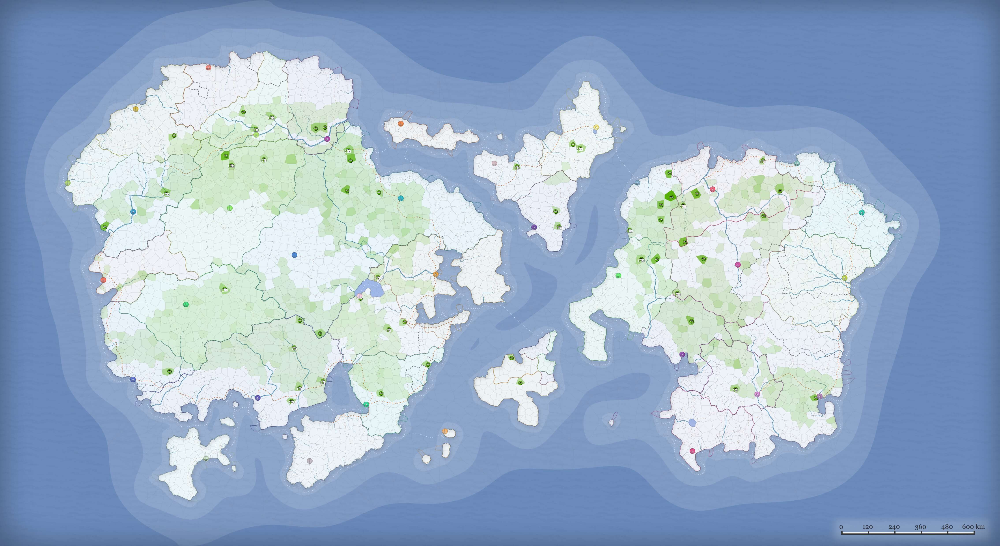

Goods are configurable resources and products that flow through the economy: wood, grain, iron, tools, wine, and so on. Each good is one of three kinds:

- **Raw**: extracted from the land (has a _distribution_ rule that decides where it appears, e.g. fish near coasts, ore in mountains).
- **Manufactured**: built from other goods via _recipes_ (e.g. tools from iron + wood).
- **Hybrid**: both extracted and manufactured.

Turn on the **Goods** layer to see three things at once: **resource icons** marking which bonus good each cell carries, a **production** shading showing how much each cell contributes, and a burg plate showing how many goods it produces. Select a good in the **Goods Editor** to see its data.

### Editing goods

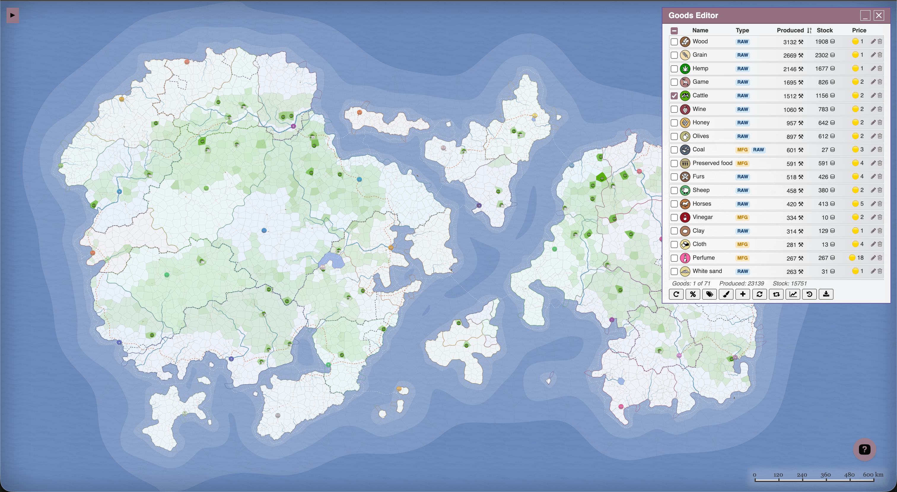

Open the **Goods Editor** (Tools → Goods, or `Shift + G`) to browse the whole set of goods, select the once to display on the map, filter by tag, and tweak. Clicking a pencil icon opens the good editor where you can set its value, icon, color, demand contribution, and multipliers.

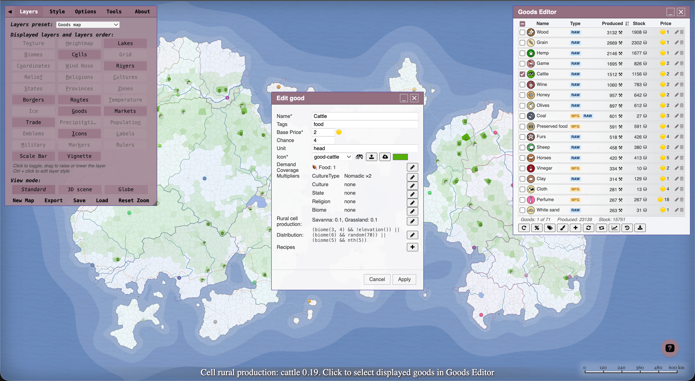

**Multipliers** let you boost or suppress a good's production along five dimensions: **culture type, culture, state, religion, and biome**. A value of `1` (or absent) means no effect, `0` means the good isn't produced at all, and anything in between
scales it. They stack multiplicatively, so you can say "wine ×2 in this culture but ×0 in that state" and have total output of `base × 2 × 0 = 0` in the second case.

For raw goods, a visual **Distribution Editor** lets you build the placement rule (biome, elevation, temperature, shoreline, rivers) without writing the expression by hand.

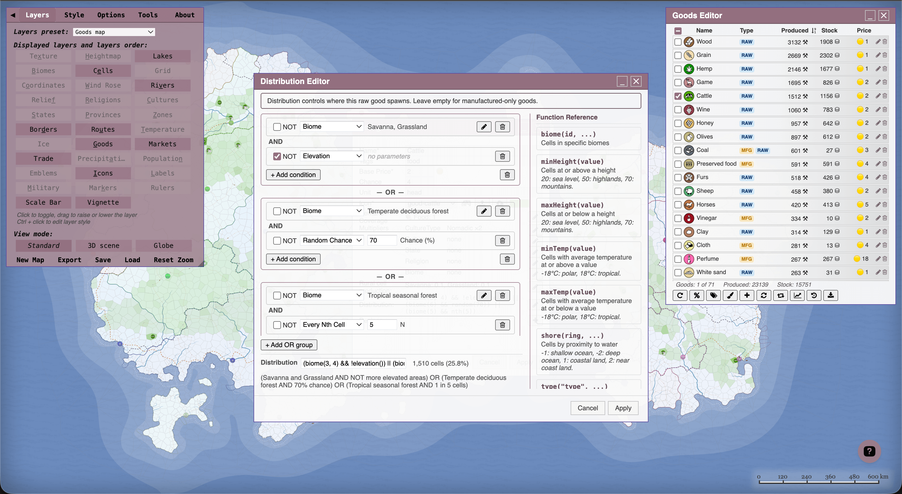

### Production chains

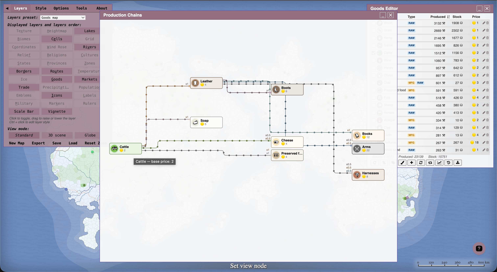

The **Production Chains** viewer draws the recipe graph – what feeds into what, so you can trace a finished good all the way back to its raw inputs.

## Markets and Production

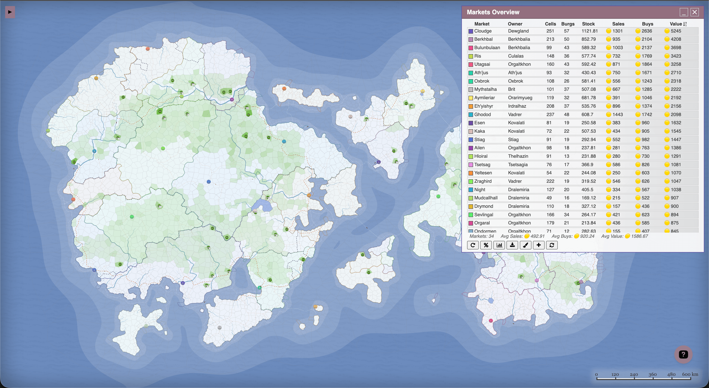

A **Market** is a regional economic hub anchored at an important burg (capitals and ports are favored). Each market claims a territory of nearby cells via a cost-aware flood fill algorithm, and all the trade in those cells flows through it. Burgs buy from and sell to their market, and markets ship goods to each other.

Within a market, the production cycle runs only once:

1. **Rural cells seed the market** with their raw production output, forming the initial stock of raw goods with local prices adjusted for demand and supply.
2. **Burgs manufacture** goods, selecting the most profitable recipes they can make with the materials available in stock or bought from the local market. Both sell and buy orders affect the market's stock and prices.
3. **Global trade** moves surpluses between markets, driven by price differences and demand.
4. **Burgs fill demand**, buying food, utilities, construction, military and luxury goods from the market to cover their population's needs.

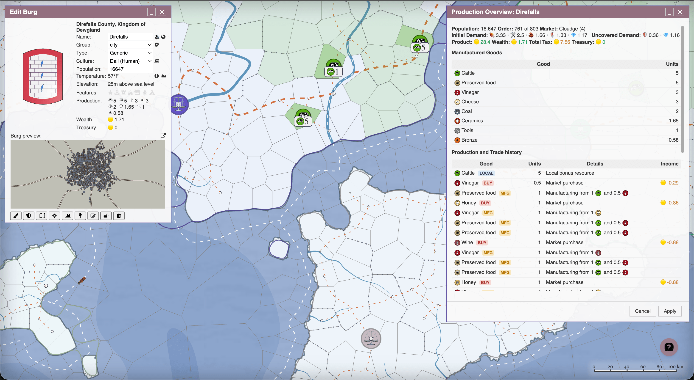

- **Markets Overview** (Tools → Markets) lists every market, lets you reassign market territory, add or remove markets, and compare a good's price across all markets. Clicking a single market opens its **Market Overview** (per-good stock and price) and **Market Deals** (the transactions it took part in).
- A burg's **Production Overview** breaks down what it made, bought, and sold.
- **Cell details** (`Shift + E`) shows the raw production of any single cell.

## Trade Animation

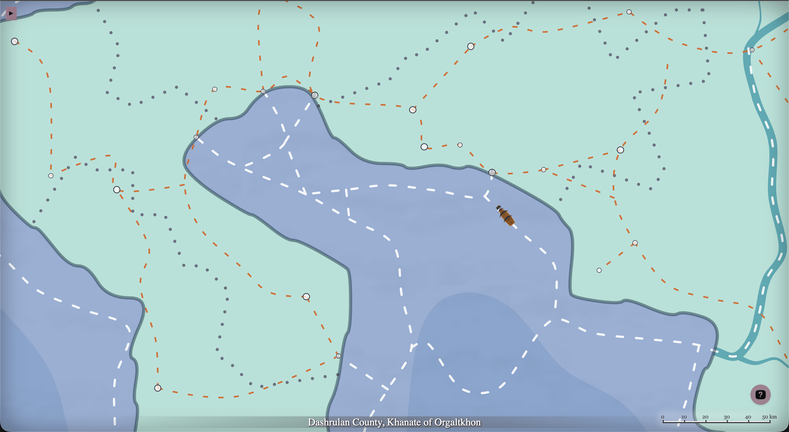

The whole economy generates a log of **deals**, capturing every buy and sell between burgs and markets. The **Trade** layer turns that log into living movement on the map: **wagons**
roll along roads and **ships** sail the sea lanes and rivers, each one a real transaction.

It's purely a visualization and it never changes your map data. The idea is to make the trade network legible at a glance: you can see which corridors are busy and where goods are flowing.

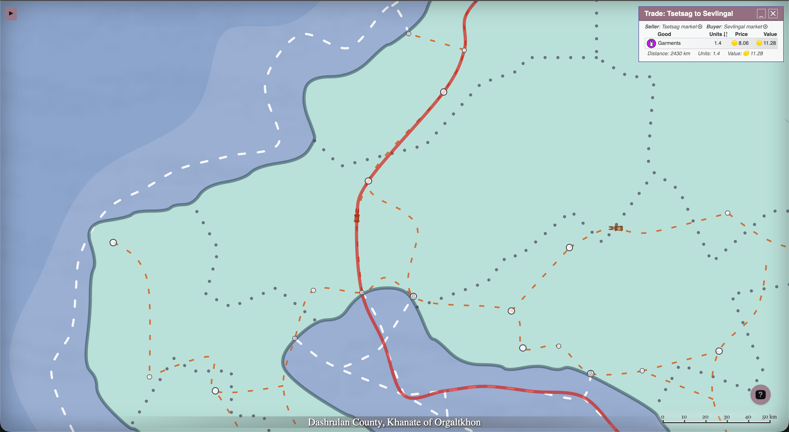

Click any moving marker to open **Trade Details**: the goods carried on that route, their quantities, prices and total value.

Tune the animation from the **Trade Animation Editor** (Tools → Trade, or backtick key `` ` `` shortcut): choose which trades to show, how many move at once, and the animation speed and size.

## Navigable Rivers

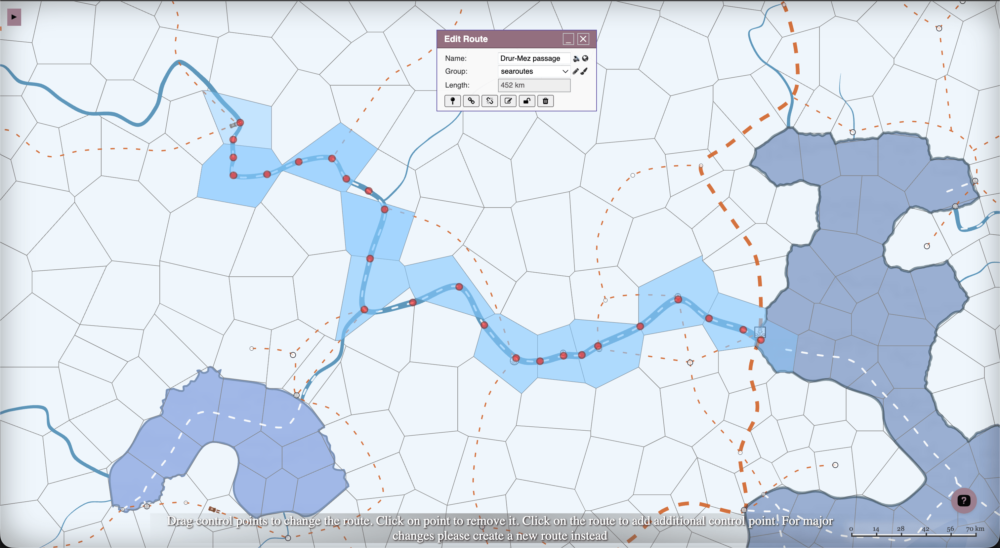

Historically, great rivers carried more cargo than coastal shipping ever did. Now they do on your maps too. **Sea routes can follow navigable rivers inland**, so a city deep in a
river basin is connected to the coast, and to other river cities, by water, not just by land trails and roads.

A few nice consequences:

- River cities above a flux threshold are marked as **ports** and join the sea-route network of whatever water body their river ultimately drains into.
- A chain of rivers and **open lakes** that reaches the ocean folds those cities into the ocean's shipping network; a basin that ends in a **closed lake** (think Caspian) forms its own self-contained network.
- The route lines now meander with the river to reflect its natural course.

There's nothing to configure: regenerate routes (or a whole map) and inland rivers light up.

## State Taxes and Treasury

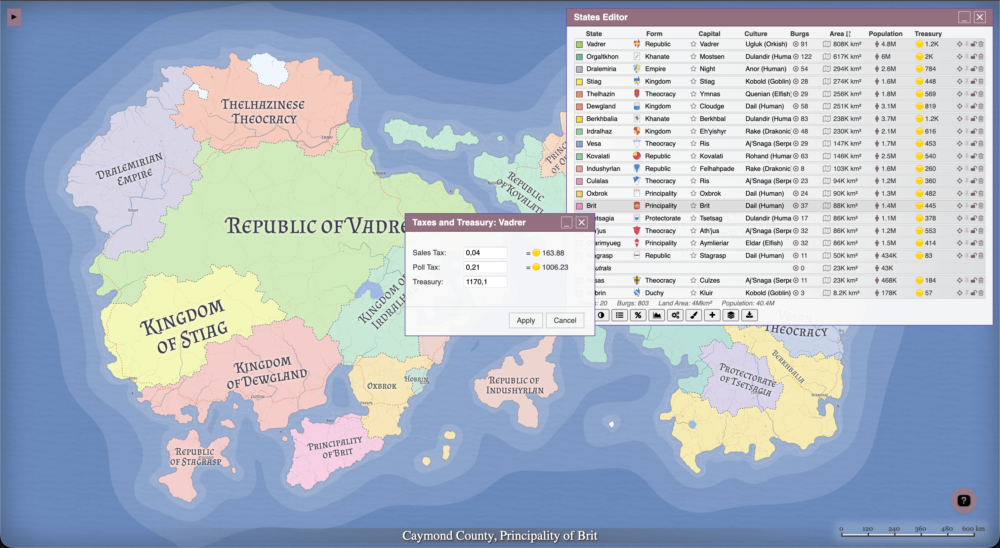

States now earn money and bank it in a **treasury**. Two taxes feed it:

- **Sales Tax** charged on sellers in every market transaction. On local sales it's taken out of the burg's revenue; on long-distance trade it's added to the buyer's landed cost, so heavily-taxing states become less competitive exporters and reduce their burgs' wealth.
- **Poll Tax**: a flat levy per head of population, collected once per cycle.

Tax rates are derived from state's **form of government** and jittered a little per state: a Theocracy taxes sales harder than a Republic, Anarchies tax nothing, and Neutrals never tax or bank anything.

Open the **States Editor** (`Shift + S`) to see the new **Treasury** column. Clicking a value opens a dialog where you can adjust the sales and poll-tax rates or override the
balance. Rate changes take effect the next time production is regenerated.

## How to try it

1. Generate a new map, or load an existing one so it's upgraded automatically.
2. In **Layers**, switch to the **Goods map** or **Trade animation** view-mode preset, or toggle the **Goods**, **Markets**, and **Trade** layers individually.
3. Explore from the **Tools** menu: **Goods** (`Shift + G`), **Markets**, and **Trade** editors, plus **Regenerate → Goods / Markets / Economy / Production** to re-roll any part of the economy.
4. Click around: markets, burgs, and moving trade markers all open detailed overviews.

As always, feedback is very welcome – especially on whether the generated trade networks and prices feel believable on your maps.
