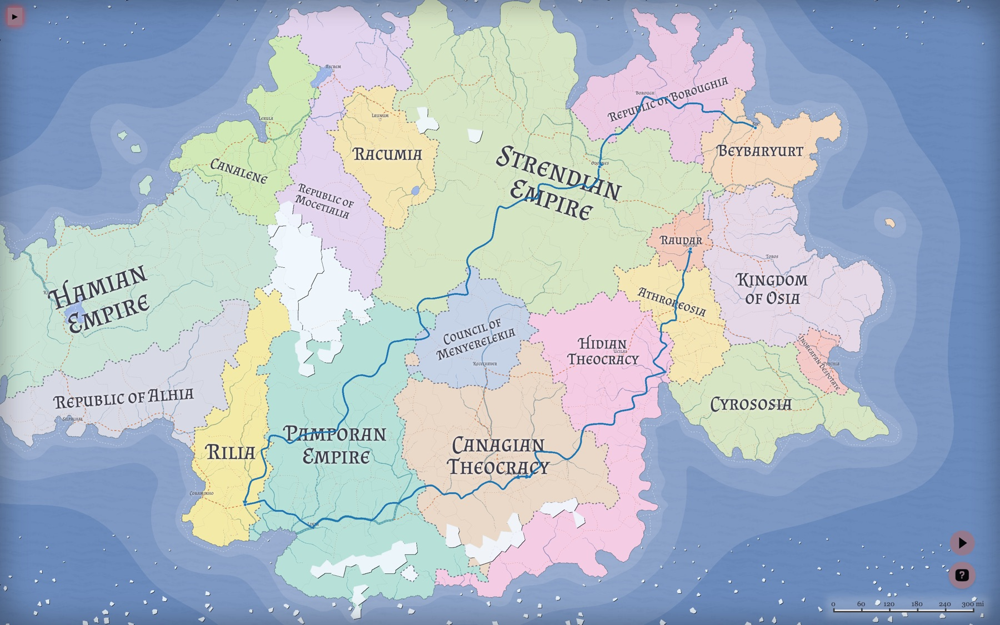
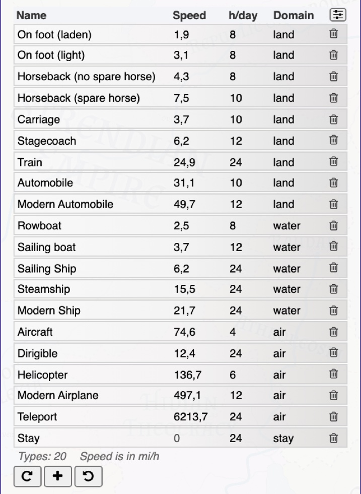
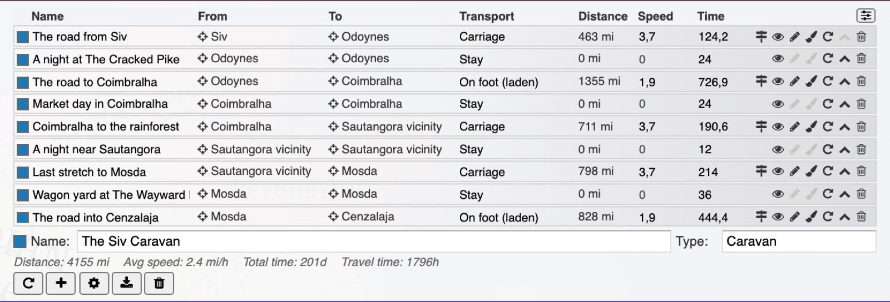
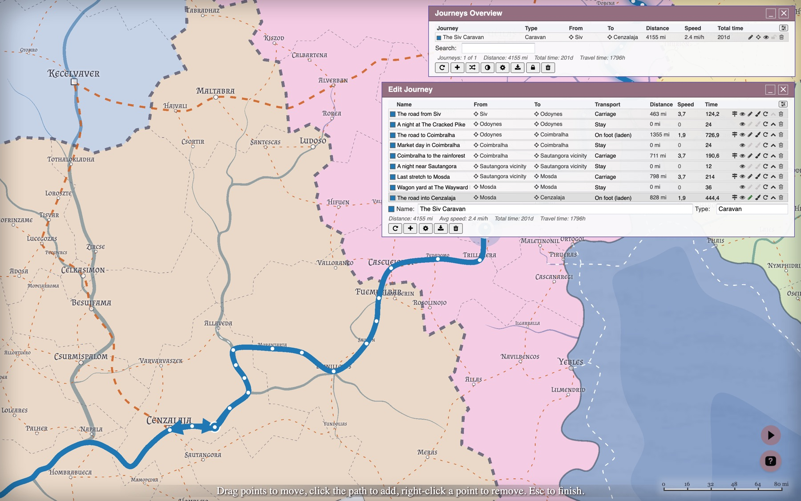
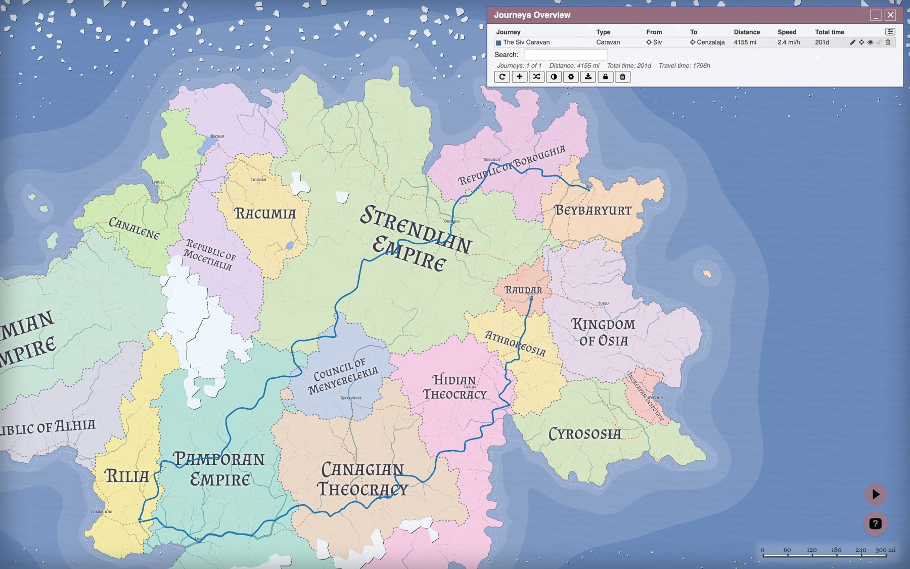
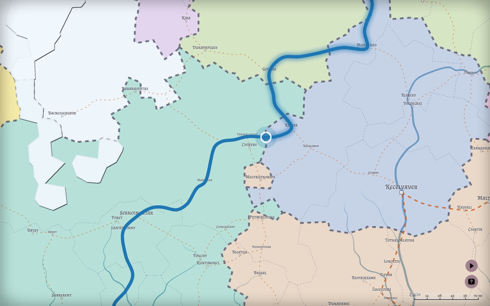

# Azgaar's Fantasy Map Generator v1.150.0: Journeys

This release adds **Journeys** – a way to plan and measure travel across the map – and completes the migration of map styling from the rendered SVG into stored data.

As always, old `.map` files keep loading and are upgraded automatically.

## Journeys

A **journey** is a named route across the map, drawn on its own `journeys` layer and saved with the map.

Open the **Journeys Overview** with `Shift + J` or Tools → Journeys. Clicking a journey path on the map opens that journey's editor directly.

### Journeys and segments

A journey is an ordered list of **segments**. Each segment is one leg of the trip and carries its own data:

- **From** and **To** – the two cells the leg runs between
- **Transport** – the mode of travel, which sets the default speed and decides where the leg may go
- **Path** – the actual point chain drawn on the map, produced by pathfinding or drawn by hand
- **Distance**, **Speed** and **Time**, each of which can be overridden
- Its own **color** and **visibility**

Splitting a trip into segments is what makes mixed travel work: sail to a port, walk inland, spend three days waiting for a caravan, ride the rest of the way. Each leg is measured on its own terms and the journey totals them up.

### Transport types and travel domains

Every transport belongs to one of four **domains**, and the domain decides both how the route is found and where it is allowed to go:

| Domain    | Routing                                                                                   | Endpoint rule                                                   |
| --------- | ----------------------------------------------------------------------------------------- | --------------------------------------------------------------- |
| **land**  | Follows the road network where one exists, otherwise a terrain-aware shortest path        | Both ends on land                                               |
| **water** | The same sea routing the generator uses for its own searoutes, including navigable rivers | Both ends in water, at a coastal haven, or on a navigable river |
| **air**   | A straight line                                                                           | Anything                                                        |
| **stay**  | No movement at all                                                                        | Anything                                                        |

The **stay** domain is what lets a journey include time that is not travel: a night at anchor, a week of requisitions, waiting out a storm. A stay covers no distance, but its hours count toward the total.

There are 20 transport types by default, from `On foot (laden)` at 3 km/h to `Teleport`. Each has a name, a speed, a **travel day** (how many hours a day it sustains) and a domain, and all four are editable in the **Transport Types** dialog. You can add your own – a magic carpet, a river barge, a giant eagle – and the set is remembered in local storage, so it carries over to your next map.

### How the route is found

For a **land** segment the generator first looks for a path through the existing route network, so a journey between two connected burgs follows the same roads a traveller would. If no road connection exists it falls back to an A\* search over the cell graph, weighted by biome movement cost and elevation, with route cells discounted – the path prefers roads where they help and cuts across country where they do not. A land segment between two different landmasses is refused rather than silently routed through the sea.

Land segments also have an **off-road** toggle. Turned on, the pathfinder penalizes road cells instead of preferring them, and the effective speed is halved.

**Water** segments reuse the generator's own sea pathfinding, so ships hug the same lanes searoutes do and can run up navigable rivers. **Air** segments ignore terrain entirely.

### Time

Travel time is computed per segment: `distance ÷ speed`, using that segment's transport. What makes the number useful is the **travel day**. A laden caravan walks eight hours a day; a steamship runs twenty-four. So the editor reports two different clocks:

- **Travel time** – hours actually spent moving or waiting, summed across the segments.
- **Total time** – calendar time from start to finish. Every full travel day a transport sustains costs a whole 24-hour day, so eight hours of walking is one day gone, and leftover hours cost only themselves.

That is why a 1,000-mile walk and a 1,000-mile sail can report the same travel hours and very different total days.

Both numbers can be overridden. Type into the **Speed** cell to change a leg's pace, or into the **Time** cell to set the duration directly – an explicit duration wins over the distance-and-speed calculation.

Hiding a segment with the eye icon takes it off the map and out of the totals, so an alternative route or a leg not yet travelled can be kept alongside the real one.

### Editing a route by hand

Every segment can be reshaped after it is generated:

- **Pick endpoints** – click _From_ or _To_, then click a cell on the map. The path is recomputed.
- **Edit points** – show the path's control points, drag them to move, click the path to insert one, right-click to remove one.
- **Draw** – lay down a custom path cell by cell, ignoring the pathfinder entirely.

Endpoints and intermediate points answer to different rules. A water route may begin and end on a shore – you board from land – but its body may only cross water or navigable river cells. A hand-drawn path is checked against its transport's domain, and changing the transport or an endpoint afterwards asks before overwriting the work.

The **Reset** button on each row discards the manual edits: it recomputes the path from the endpoints and restores the default color, speed and time.

### Generated journeys

Every new map is generated with one journey already on it, and the **Generate a random journey** button in the Overview adds more.

These are not random lines between random points. The generator picks one of 18 **archetypes** – Quest, Caravan, Military campaign, Pilgrimage, Raid, Smuggling run, Courier ride, Refugee flight, Royal progress, Airship voyage and so on. The archetype decides how the party travels (which domains, weighted, and which transports it prefers), how likely it is to leave the roads, how often it stops over in a burg or camps in the open, and how the journey and its legs are named. A caravan takes the roads and rests in towns; a raid does not.

The result is a plotted route with named legs – _The road from Siv_, _A night at The Cracked Pike_, _Market day in Coimbralha_ – that can be used as-is, edited, or deleted.

### Working with journeys

The **Journeys Overview** lists every journey with its type, endpoints, total distance, average speed and total time. It supports search, sortable columns, per-journey visibility, locking (locked journeys survive _Remove all_), zoom-to-journey and CSV export.

Hovering a row in the Overview animates a traveller along the whole route; hovering a row in the Journey Editor animates just that segment. Slow legs take visibly longer than fast ones, and a stay pulses in place.

Journeys are stored in the `.map` file, included in JSON export, preserved through Submap and Transform, and styled like any other layer through the Style Editor. Both dialogs export CSV – the Overview one row per journey, the Editor one row per segment, with transport, distances, speeds and times.

---

## Styles are now data

Until now the rendered SVG was the only place your styling lived. The Style Editor wrote attributes onto the drawing, the `.map` file stored the whole drawing, and anything that went wrong with the drawing silently became your new style. Several long-standing bugs came from exactly this.

Styling now lives in a single validated style record: the editor writes it, the renderers read it, and the `.map` file saves it as data. On load, an older map's styling is read out of its SVG into the record automatically.

Invalid values are now repaired individually rather than costing the whole layer its styling, so one bad attribute no longer resets everything around it.

## Desktop app

The desktop app got a proper Quit entry on Linux and Windows, closing it asks for confirmation once instead of once per window event, and on Linux it can now be installed and run from a Nix flake.

## Credits

- _[msuyar](https://github.com/Azgaar/Fantasy-Map-Generator/commits?author=msuyar)_ kicked off the Travel Builder – the journey pathfinding, editable segment paths, stay segments and custom-drawn routes all started there.
- _[barrulus](https://github.com/Azgaar/Fantasy-Map-Generator/commits?author=barrulus)_ worked on the style update and the desktop app improvements.

Thanks to both, and to everyone who reported the styling issues that made the migration worth doing.

## What is next

The direction from the v1.149.0 notes stands: finish the shell migration (`options.js` and `main.js` remain the largest holdouts), break up `index.html`, and keep cleaning up the data model – the style record is one step of that, not the last one.
