# Azgaar's Fantasy Map Generator v1.153.0: Omnibar

This release adds a global search bar that finds anything on the map and runs almost any command, a brush that reshapes cells directly on the map, and a set of map embellishments – hachures, sea waves, coastal bands, lake ripples – with three new style presets built on them. Geographical features (islands, lakes, oceans) get names and an overview of their own, and the Coastline Editor can now change a specific island or lake.

As always, old `.map` files keep loading and are upgraded automatically.

## Omnibar

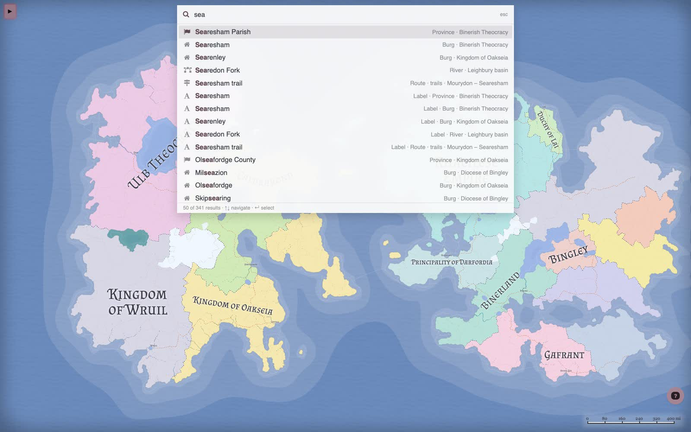

Press <kbd>Space</kbd> or click **Search** in the menu, and a search field opens over the map. Type a name and the results list every burg, state, province, river, route, marker, zone, journey, market, regiment, culture, religion, biome, good, island, lake or ocean that matches, plus every label as a separate entry. Selecting a result opens its editor. Labels and entities without an editor are revealed on the map: the needed layers are enabled, and the view zooms to and highlights the result.

Notes are searched too. If you remember something written about a place but not its name, the matching excerpt shows up in the result line.

Commands sit in the same list, marked with `>`; type `>` first to see only commands. There are about 170 of them: open any editor or overview, add a burg, label, marker, river or route, toggle a layer, regenerate states, burgs, rivers and so on, save, load, export, open the 3D scene. Typing a question surfaces the _Ask AI_ command, which opens the Azgaar Assistant.

<kbd>↑</kbd> and <kbd>↓</kbd> move through the list, <kbd>Enter</kbd> selects, <kbd>Esc</kbd> closes. The last ten commands you used are shown when the field is empty and are remembered between sessions; entities are never stored.

## Wrap Tool

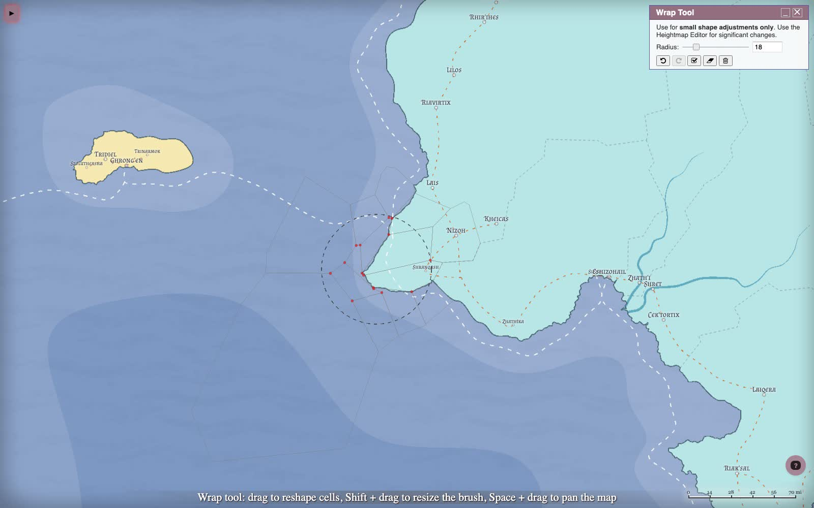

The **Wrap Tool** (Tools → Create → Wrap, or <kbd>Shift</kbd> + <kbd>W</kbd>), inspired by Watabou's work, reshapes the map with a brush. It moves the vertices of map cells, so shores, state, province, culture, religion and biome borders, zones and the heightmap all follow together. Use it to nudge a coastline, round off a lake shore or bend a state border where the Heightmap Editor is too coarse.

Nothing else moves: burgs, rivers, routes, labels, markers and every generated value stay where they are. It is a shape tool, not a terrain tool – for a new island or a mountain range use the Heightmap Editor.

- **Drag** pushes the corners under the brush in the direction of the drag; the movement fades towards the brush edge. Hover to see which corners the brush covers (red dots) and which cells they shape.
- **Resize** with <kbd>Shift</kbd> + drag, the <kbd>+</kbd> / <kbd>−</kbd> keys, or the _Radius_ slider. The smallest radius is below a cell's size, so a single corner can be moved on its own.
- **Zoom** with the wheel and **pan** with <kbd>Space</kbd> + drag while the tool is open.
- **Undo** / **Redo** step through the strokes of the session (<kbd>Ctrl</kbd> + <kbd>Z</kbd> / <kbd>Ctrl</kbd> + <kbd>Y</kbd>).
- **Apply** keeps the changes and starts a fresh session. **Reset** drops the session's strokes. **Revert all** removes every vertex edit ever made on the map, including ones loaded from the file.

The brush stops before a cell can fold over itself, and every corner has a limited travel distance from where the generator placed it. With the Wrap Tool in place, the per-feature drag handles in the Lake and Coastline editors are gone.

## Coastlines

Coastline roughness is now keyed to the position on the map rather than to the sequence of edges around a feature. In practice: editing the heightmap or wrapping a coast in one place changes the coastline there and nowhere else, and the same map with the same settings always draws the same coast.

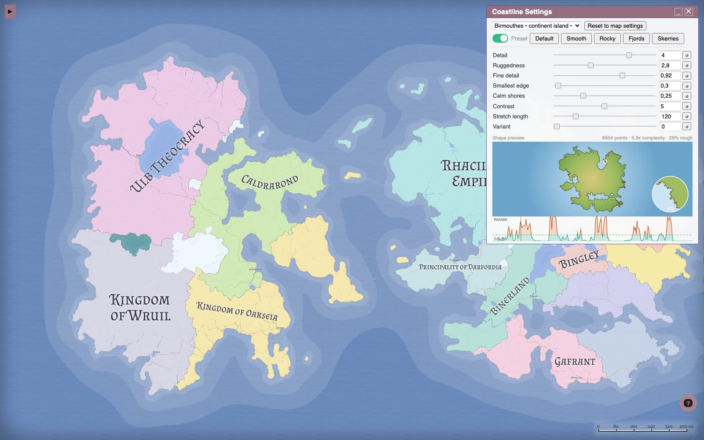

The Coastline Editor (Tools → Coastlines) has a selector at the top: _Whole map_, or any island or lake. The first change made with a feature selected gives it its own settings, and from then on the map settings do not touch it. The previews follow the selection: the real shape of the feature with rough stretches in orange and calm ones in teal, a magnifier on the roughest bit of shore, and the roughness sampled around its coast. Per-feature settings are saved with the map.

## Geographical Features Overview

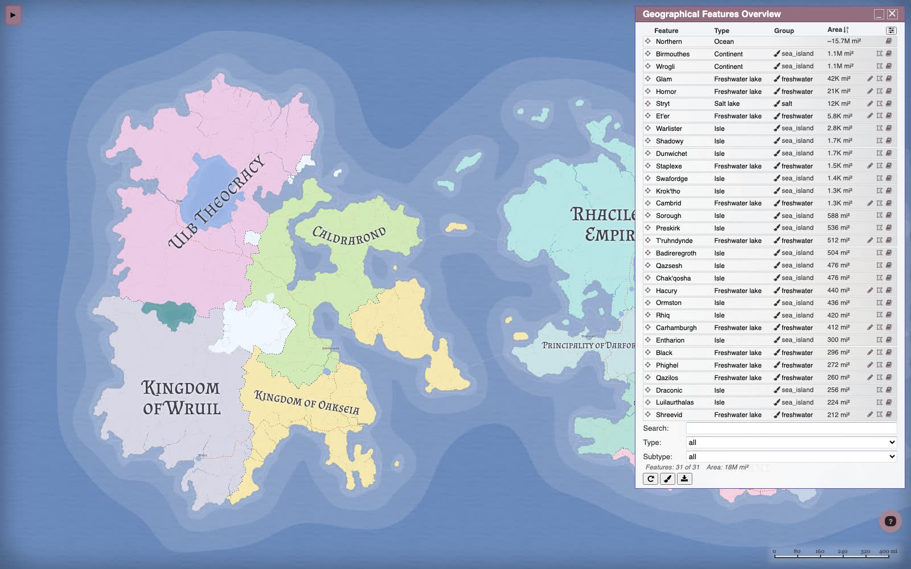

Every island, lake and ocean the heightmap produced is now listed in one table (Tools → Features, or <kbd>Shift</kbd> + <kbd>F</kbd>). Features come from the terrain, so they cannot be added or removed here – the overview is where they are named, classified and given notes.

Every feature now has a name. Islands use the culture of their first land cell, and lakes use a shore cell, with one in ten getting a plain English adjective instead; oceans get an English adjective or a directional name. Existing names are preserved, and older maps receive missing feature names when loaded.

## Ink style and engraved embellishments

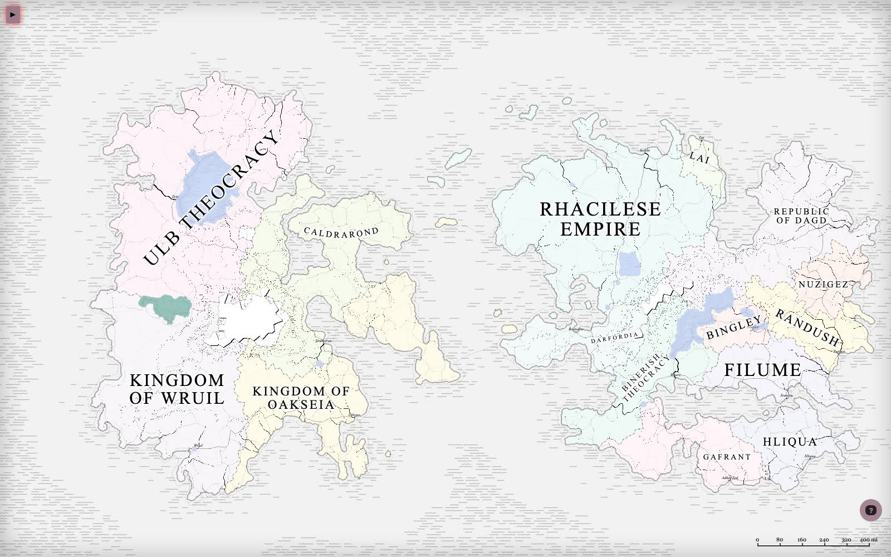

Three new presets are added to the Style tab: **Ink**, a black-and-white print look; **Cinderwood**, a warm parchment with illustrated relief and settlement icons; and **Frostbite**, a cold palette with hatched seas. They are built from a set of new rendering options that can be used with any style.

### Hachures

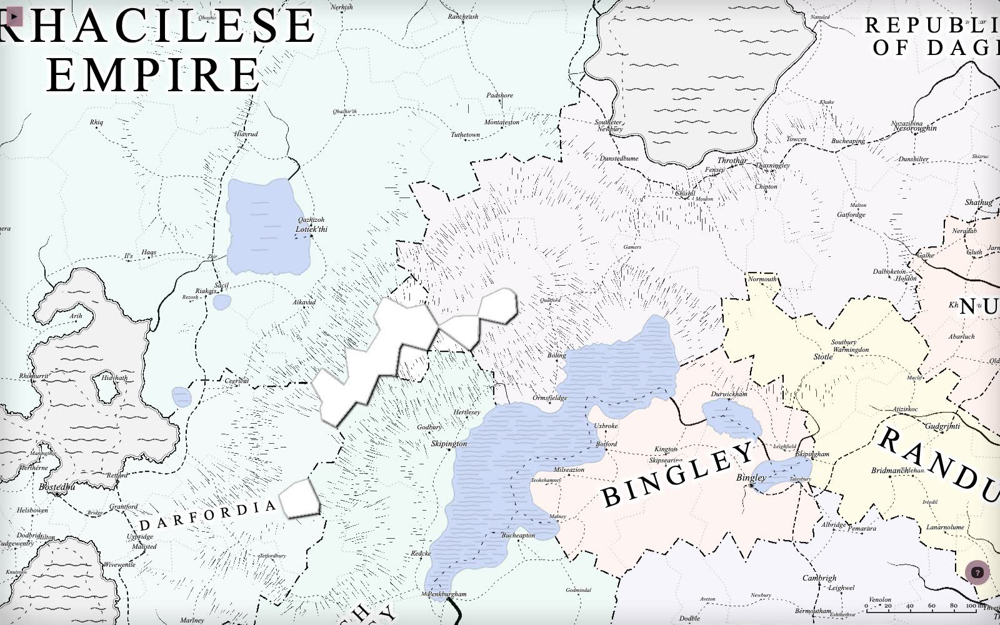

Hachures are the engraved alternative to contour lines: short tapered strokes running down the slope, packed tighter and drawn heavier where the ground is steep, thinning out towards the foot. Flat ground and crests stay clear, so mountain ranges read as hatched masses with white ridge lines.

They live on the heightmap layer. Open Style → Heightmap, pick _landHeights_ or _oceanHeights_, and set **Hachures** to _Over colors_ or _Strokes only_. Strokes are placed deterministically from the map seed, so redraws are stable.

### Ocean waves and coastal bands

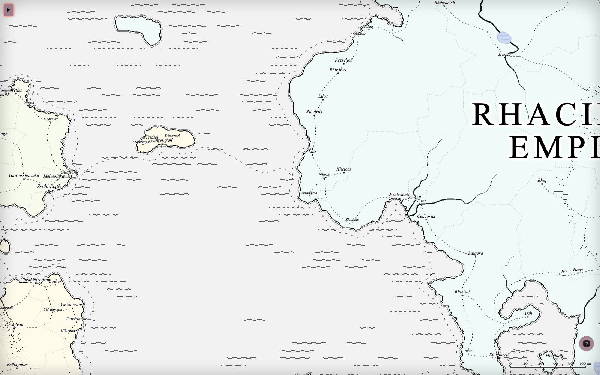

Style → Ocean gets two additions:

- **Ocean embellishment** – _Waves_ or _Straight strokes_ over the water, thinning out from the shore, with a clear band along the coast that follows the continents.
- **Coastline bands** – concentric bands stepping out from every shore, merging across straits and around island groups.

### Lake ripples

Style → Lakes has an **embellishment** setting per lake group: _Ripples_ or _Straight strokes_ along the banks, fading towards open water.

### Illustrated icons

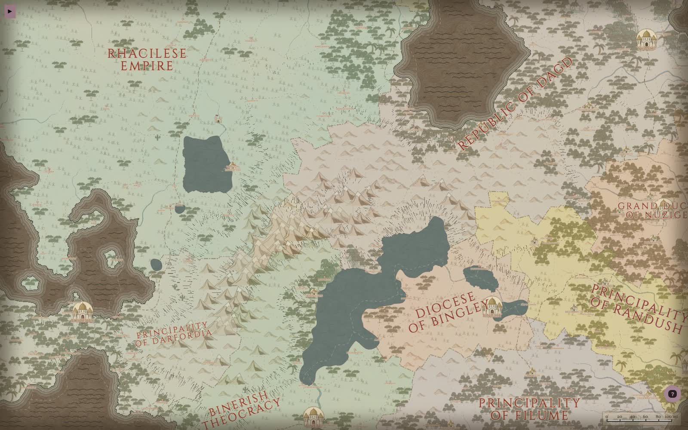

- A new **Illustrated** relief set – mountains, hills, forests, palms, swamps, dunes, cacti, volcanoes – alongside Simple, Colored and Gray.
- A new **Illustrated** burg icon family: _Palace_, _Burgh_, _Castle_, _Abbey_, _Caravanserai_ and _Camp_. The fill and stroke you set on a burg group recolor the icon.
- Port symbols are now styled on their own: choose **Anchor** or the new **Harbor** icon, with size and an offset from the burg.

### Label styling

Style → Labels has three new settings per label group: **font weight** (100–950), **font style** (normal or italic) and **text transform** (uppercase, lowercase, capitalize). Text transform changes how the label is displayed, not the name itself. Cinderwood uses Cinzel at weight 900 in uppercase; Frostbite uses the Iceberg font for most labels and Snowburst One for route labels; both are new in the font list.

### Frostbite

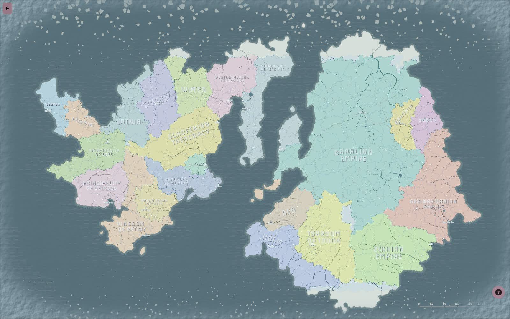

Frostbite puts the pieces together differently: straight strokes over the sea instead of waves, coastal bands on a dark ocean, the Gray relief set, Watabou settlement icons and shadowed labels in small caps.

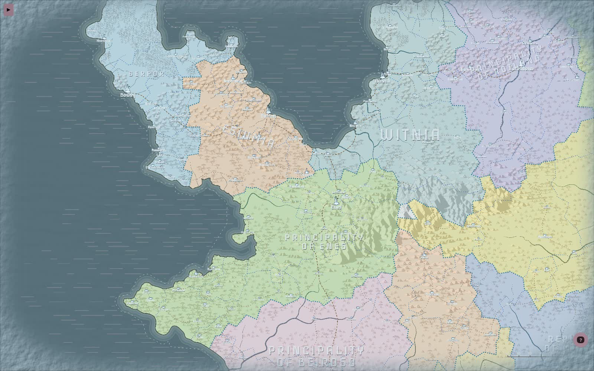

## Drainage view

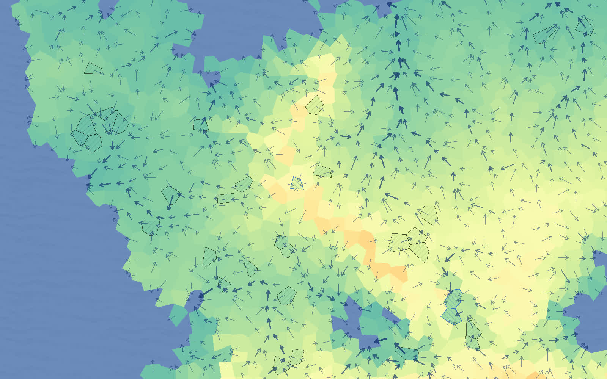

The Heightmap Editor gets a **Show drainage** option in the Tools tab. Every land cell gets an arrow pointing where its water flows, drawn heavier where more cells drain through, so river valleys read at a glance. Depressions that water cannot leave are hatched: black for the ones the generator will fill on finalization, blue for the ones deep enough (see the depression depth threshold) to become lakes when water erosion is allowed. The overlay stays on while you paint and updates after every edit, so cut an outlet or raise the floor and watch the hatching go.

## Performance settings

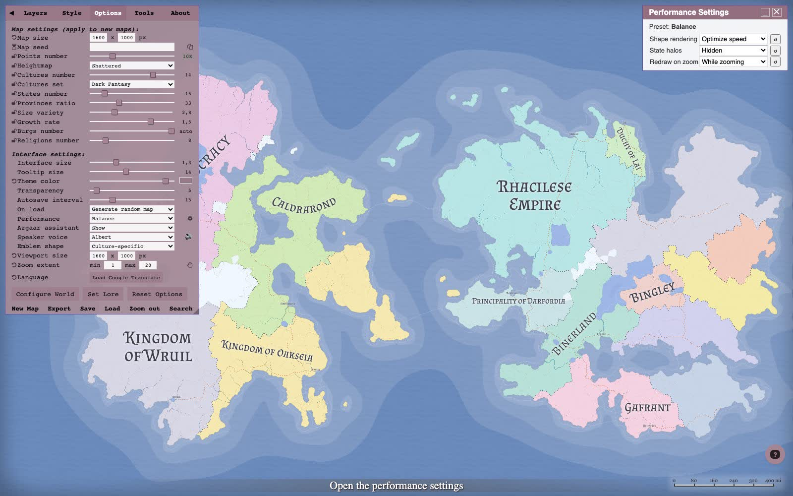

The _Rendering_ and _Redraw on zoom_ options on the Options tab are replaced by a single **Performance** preset – _Quality_, _Balance_ (the default) or _Speed_ – and a cog that opens the individual settings:

| Setting             | Quality             | Balance        | Speed          |
| ------------------- | ------------------- | -------------- | -------------- |
| **Shape rendering** | geometric precision | optimize speed | optimize speed |
| **State halos**     | shown               | hidden         | hidden         |
| **Redraw on zoom**  | while zooming       | while zooming  | after zoom     |

_State halos_ is new as a setting: the blurred glow along state borders is an SVG filter, and it is one of the more expensive things to redraw.

## Dialog reset

Dialogs remember their position, visible columns and sorting between sessions since v1.152.0. Once a dialog has been moved, or its columns or sorting changed, a reset button appears in its title bar, next to minimize and close, that puts all three back to the defaults.

## Other changes

- Overview tables retain earlier sorts as tie-breakers. Sort burg names first, then provinces, to keep names alphabetical within each province.
- Manufacturing chains use available stock before counting workers for missing ingredients. This fixes inflated work estimates that could block complex products; regenerate Production on an existing map to recalculate it.
- Edited burg icon and anchor sizes survive saving and reloading maps with missing style groups.
- Regenerating diplomacy works after a state has been removed.
- Empty legend boxes no longer reappear with an "undefined" row.
- Opening and closing editors no longer leaks memory.
- The Icon Selector accepts your own SVG or raster icon files, by _[barrulus](https://github.com/barrulus)_.
- The PWA works offline after the first load, by _[barrulus](https://github.com/barrulus)_.
- Several legend boxes can be shown at the same time, by _[esullivan9](https://github.com/esullivan9)_.
- Diplomacy Editor: click a state on the map to pick the relation target, by _[barrulus](https://github.com/barrulus)_.
- Marker Editor got a name field.
- Fog of war covers the whole map, not just the viewport it was drawn in.
- Firefox keeps global filters in raster exports, by _[barrulus](https://github.com/barrulus)_.

## Guides

- [Omnibar](https://github.com/Azgaar/Fantasy-Map-Generator/wiki/Omnibar)
- [Wrap Tool](https://github.com/Azgaar/Fantasy-Map-Generator/wiki/Wrap-Tool)
- [Coastline Editor](https://github.com/Azgaar/Fantasy-Map-Generator/wiki/Coastline-Editor)
- [Geographical Features Overview](https://github.com/Azgaar/Fantasy-Map-Generator/wiki/Geographical-Features-Overview)
- [Map embellishments](https://github.com/Azgaar/Fantasy-Map-Generator/wiki/Map-embellishments)
- [Heightmap customization and drainage](https://github.com/Azgaar/Fantasy-Map-Generator/wiki/Heightmap-customization)
- [Performance settings](https://github.com/Azgaar/Fantasy-Map-Generator/wiki/Performance-settings)
- [Table sorting and dialog reset](https://github.com/Azgaar/Fantasy-Map-Generator/wiki/User-Interface#controls)

## Credits

- _[barrulus](https://github.com/barrulus)_ – multiple fixes.
- _[esullivan9](https://github.com/esullivan9)_ – simultaneous legend boxes.

Thanks to everyone who reported bugs and suggested features on Discord, Reddit and GitHub.

## What is next

The JS-to-TypeScript migration is down to its last two legacy modules, the Style Editor and its presets, and `index.html` is still a 9K-line monolith that needs to be broken up. Those are the next structural jobs; the engraved embellishments and the Wrap Tool will be refined from feedback.
