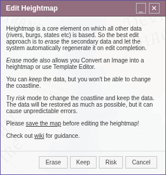
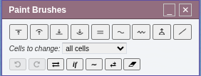
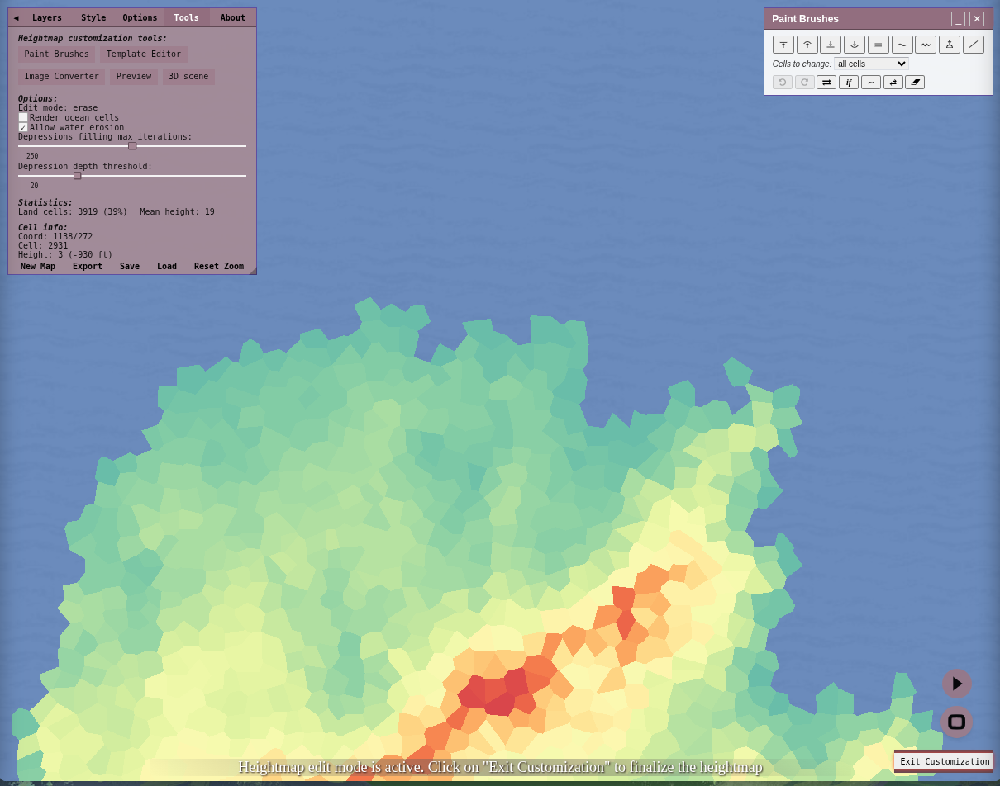
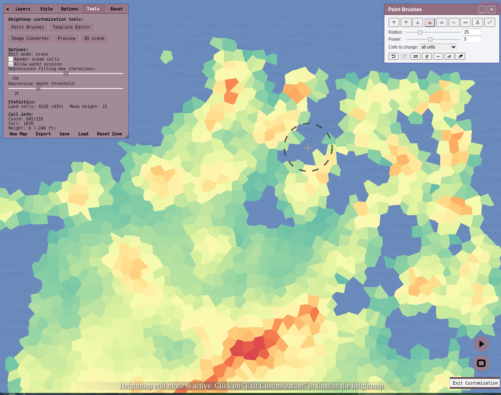
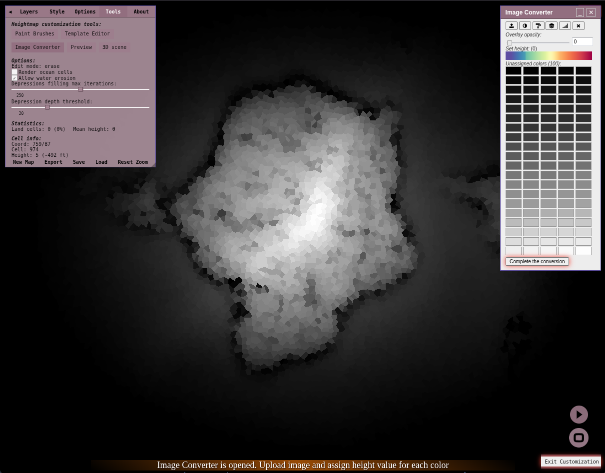

The **heightmap editor** allows you to create and customize the heightmap manually, giving you more control over the world's terrain, unlike random generation.

To access the Heightmap Editor, you can either:
1. Navigate to Tools > Heightmap in the menu. (Look at the image below)
2. Use the hotkey *shift + h*.

Show Image

### Modes
The heightmap editor offers three different modes to choose from. Its recommended to save your map beforehand.
1. **Erase**:
   - This mode regenerates all data on your map, including cultures, states, biomes, and more.
   - It offers the most customization features, such as the image converter and template editor.

2. **Keep**:
   - This mode allows you to retain most of the map's existing data.
   - However, it does not allow changes to the coastline.

3. **Risk**:
   - This mode allows you to keep most of the map's data while also allowing changes to the coastline.
   - Note that using this mode can potentially cause some errors.

Show Image

### Heightmap Editor Features

The Heightmap Editor includes tools to help you create and customize your map. Below is a detailed list of all available features:

- **Paint Brushes**:
  - Automatically opens and allows you to edit the map.
  - Use different brushes to draw and modify the height.

- **Template Editor**:
  - Edit, load, or create templates for your heightmap.

- **Image Converter**:
  - Convert images into heightmaps.

- **Preview**:
  - Displays a monochromatic image of the map in the bottom left corner.
  - You can click the image to download it.

- **3D Scene**:
  - Opens a 3D version of the map in a new window.
  - Allows for a more immersive view of the map's shape and features.

- **Render ocean cells**:
  - Checkbox that toggles whether ocean/water cells are drawn in the preview.
  - This only affects the display, not the underlying data — it doesn't add or remove water bodies.

- **Allow Water Erosion**:
  - Simulate water erosion effects on the terrain.
  - Adds realism to the map by shaping the landscape according to water flow.

Once you are satisfied with the Heightmap, click on **Exit Customization** in the bottom right.

Show Image

## Paint brushes

Before and after a raise-brush stroke:

  - **Radius (top slider)**: Controls the radius for brushes.
  - **Power (bottom slider)**: Controls the intensity of brushes.
    - Note: This has no effect on align tool.
  - **Raise**: Increases cell height by power value; drag for continuous usage.
  - **Elevate**: Drag to gradually increase cell height by power value.
  - **Lower**: Decreases cell height by power value; drag for continuous usage.
  - **Depress**: Drag to gradually decrease cell height.
  - **Align**: Fits cell height to the first tagged cell; drag for continuous usage.
  - **Smooth**: Smooths cell height; drag the map for continuous usage.
  - **Disrupt**: Randomizes heights slightly; drag for continuous usage.
  - **Fill**: Click an enclosed water area or a same-height land area to flood-fill it into a cone-shaped blob.
  - **Line Tool**: Creates mountains or trenches in lines.
    - The **Power** slider (-100 to 100) sets both intensity and direction: positive values raise a mountain range, negative values lower a trench.
    - The **Randomness** slider (0-100) controls how much the line meanders instead of running straight.
  - **Cells to change** dropdown ("all cells" / "only land cells" / "only water cells"): replaces the old "change only land cells" checkbox. It's a 3-way filter that restricts brushes (and the footer tools below) to land cells, water cells, or all cells — "only water cells" is a newer option that restricts changes to ocean cells only.

### Footer Buttons
  - **Un-do**: Steps back, works only for Heightmap customization.
  - **Re-do**: Steps forward, works only for Heightmap customization.
  - **Rescaler**: Slider (-10 to 10, step 1) to raise or lower all cells at once.
  - **Condition**: Conditional height rescaler. Set a height range (h ≥ X and ≤ Y) and an operation to apply to matching cells: multiply, divide, add, subtract or exponent, with an operand from 0 to 1.5.
  - **Smooth**: Smooths all heights a bit.
  - **Disrupt**: Randomizes all heights a bit.
  - **Clear**: Sets all heights to 0.

Show Image

## Template Editor

Please see [Template Editor](../wiki/Heightmap-template-editor).

## Related Tools-menu tools

Two other Tools-menu features are heightmap-adjacent and destructive, though they live outside the heightmap editor itself:

* **Transform map** (Menu → Tools → Transform) re-triangulates the whole map, letting you shift, rotate, scale and mirror it horizontally or vertically.
* **Create a submap** (Menu → Tools → Submap) crops the current viewport into a new, denser map, with an option to "Rescale burg styles" so icon and label sizes fit the new scale.

See also [Scale and distance](../wiki/Scale-and-distance) for more on both.

## Image Converter

Once opened, you'll be asked to select an image from your files.

- **Upload Image**:
  - Here you can upload a different image you’d like to convert into a heightmap.
  - Recommended are monochromatic images with black representing the ocean.

- **Auto-Assign Colors Based on Luminosity**:
  - This option assigns the colors to heights based on their luminosity.
  - Good for monochromatic images.

- **Auto-Assign Colors Based on Hue**:
  - This option assigns the colors to heights based on their hue.
  - Suitable for maps with differing colors.

- **Auto-Assign Colors Based on Generated Scheme**:
  - This option assigns the colors to heights based on Azgaar's bright color scheme.
  - Ideal for maps made with the generator.

- **Set Maximum Amount of Colors**:
  - Allows you to set the number of colors you can assign.
  - Can be any number from 3 to 255.

- **Cancel the Conversion**:
  - Cancel the image conversion and revert back to the previous map.

- **Complete the Conversion**:
  - Fully loads the map into the Fantasy Map Generator.
  - All unassigned colors will default to ocean.

To assign a color by hand, click the color you want to edit and then click the height you want on the set height slider.

Show Image

