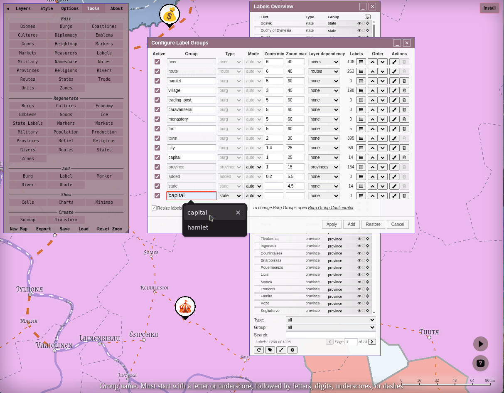
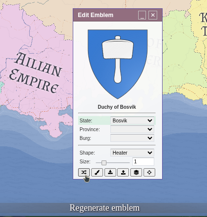

Part of the [FMG Q&A](Q&A). Related topics are listed there.

## Labels and style

### How do I add my own text or label to the map?
Tools tab → Add label button → click the map where the text goes (hold <kbd>Shift</kbd> to place several). Click any label to edit its text; fonts, sizes and colors per label group are in Style → Labels.

### How do I keep burg labels visible when zoomed out?
Style → Labels → uncheck "Toggle visibility automatically".

### Does the tool name mountains, forests and seas?
Not automatically. Add labels manually for natural features (Tools → Add label).

### Can I overlay my own image on the map?
Yes, as a Texture: Style → select the Texture element → use the plus icon next to the image dropdown, provide the image URL and apply. The image host must allow CORS requests. See also [Heightmap image overlay](Heightmap-image-overlay).

### Can I recolor relief icons, or draw them above routes?
Icon colors can't be changed, but there is an alternative pre-colored icon set in Style, and you can make icons semi-transparent to tint them from below. Layer order (e.g. relief above routes) is changed by dragging the toggle buttons on the Layers tab. Adding new relief icons is not supported.

### How do I regenerate emblems (coats of arms)?
For everything: Tools → regenerate Emblems. For one state, province or burg: click its emblem and use Regenerate in the Edit Emblem dialog.

### What do the Style sliders like "Stroke dash" mean?
They are standard SVG properties. Stroke dash sets the line's dash pattern and endcaps (round, butt, square). Hover any control for a tooltip explaining it.
