**FMG data model** is poorly defined, inconsistent and not documented in the codebase. This page is the first and the only attempt to document it. Once everything is documented, it can be used for building a new consistent model.

FMG exposes all its data into the global namespace. The global namespace is getting polluted and it can cause conflicts with 3rd party extensions. Meanwhile it simplifies debugging and allows users to run custom JS code in dev console to alter the tool behavior.

# Basic objects
FMG has two meta-objects storing most of the map data:
* `grid` contains map data before _repacking_
* `pack` contains map data after _repacking_

Repacking is a process of amending an initial [voronoi diagram](https://en.wikipedia.org/wiki/Voronoi_diagram), that is based on a jittered square grid of points, into a voronoi diagram optimized for the current landmass (see [my old blog post](https://azgaar.wordpress.com/2017/10/05/templates) for the details). So the `pack` object is used for most of the data, but data optimized for square grid is available only via the `grid` object.

## Voronoi data
Both `grid` and `pack` objects include data representing voronoi diagrams and their inner connections. Both initial and repacked voronoi can be build from the initial set of points, so this data is stored in memory only. It does not included into the .map file and getting calculated on map load.

### Grid object
* `grid.cellsDesired`: `number` - initial count of cells/points requested for map creation. Used to define `spacing` and place points on a jittered square grid, hence the object name. Actual number of cells is defined by the number points able to place on a square grid. Default `cellsDesired` is 10 000, maximum - 100 000, minimal - 1 000
* `grid.spacing`: `number` - spacing between points before jittering
* `grid.cellsY`: `number` - number of cells in column
* `grid.cellsX`: `number` - number of cells in row
* `grid.points`: `number[][]` - coordinates `[x, y]` based on jittered square grid. Numbers rounded to 2 decimals
* `grid.boundary`: `number[][]` - off-canvas points coordinates used to cut the diagram approximately by canvas edges. Integers
* `grid.cells`: `{}` - cells data object, including voronoi data:
* * `grid.cells.i`: `number[]` - cell indexes `Uint16Array` or `Uint32Array` (depending on cells number)
* * `grid.cells.c`: `number[][]` - indexes of cells adjacent to each cell (neighboring cells)
* * `grid.cells.v`: `number[][]` - indexes of vertices of each cell
* * `grid.cells.b`: `number[]` - indicates if cell borders map edge, 1 if `true`, 0 if `false`. Integers, not Boolean

* `grid.vertices`: `{}` - vertices data object, contains only voronoi data:
* * `grid.vertices.p`: `number[][]` - vertices coordinates `[x, y]`, integers
* * `grid.vertices.c`: `number[][]` - indexes of cells adjacent to each vertex, each vertex has 3 adjacent cells
* * `grid.vertices.v`: `number[][]` - indexes of vertices adjacent to each vertex. Most vertices have 3 neighboring vertices, bordering vertices has only 2, while the third is still added to the data as `-1`

### Pack object
* `pack.cells`: `{}` - cells data object, including voronoi data:
* * `pack.cells.i`: `number[]` - cell indexes `Uint16Array` or `Uint32Array` (depending on cells number)
* * `pack.cells.p`: `number[][]` -  cells coordinates `[x, y]` after repacking. Numbers rounded to 2 decimals
* * `pack.cells.c`: `number[][]` - indexes of cells adjacent to each cell (neighboring cells)
* * `pack.cells.v`: `number[][]` - indexes of vertices of each cell
* * `pack.cells.b`: `number[]` - indicator whether the cell borders the map edge, 1 if `true`, 0 if `false`. Integers, not Boolean
* * `pack.cells.g`: `number[]` - indexes of a source cell in `grid`. `Uint16Array` or `Uint32Array`. The only way to find correct `grid` cell parent for `pack` cells

* `pack.vertices`: `{}` - vertices data object, contains only voronoi data:
* * `pack.vertices.p`: `number[][]` - vertices coordinates `[x, y]`, integers
* * `pack.vertices.c`: `number[][]` - indexes of cells adjacent to each vertex, each vertex has 3 adjacent cells
* * `pack.vertices.v`: `number[][]` - indexes of vertices adjacent to each vertex. Most vertices have 3 neighboring vertices, bordering vertices has only 2, while the third is still added to the data as `-1`

## Features data
Features represent separate locked areas like islands, lakes and oceans.

### Grid object
* `grid.features`: `object[]` - array containing objects for all enclosed entities of original graph: islands, lakes and oceans. Feature object structure:
* *  `i`: `number` - feature id starting from `1`
* *  `land`: `boolean` - `true` if feature is land (height >= `20`)
* *  `border`: `boolean` - `true` if feature touches map border (used to separate lakes from oceans)
* * `type`: `string` - feature type, can be `ocean`, `island` or `lake

### Pack object
* `pack.features`: `object[]` - array containing objects for all enclosed entities of repacked graph: islands, lakes and oceans. Note: element 0 has no data. Stored in .map file. Feature object structure:
* *  `i`: `number` - feature id starting from `1`
* *  `land`: `boolean` - `true` if feature is land (height >= `20`)
* *  `border`: `boolean` - `true` if feature touches map border (used to separate lakes from oceans)
* * `type`: `string` - feature type, can be `ocean`, `island` or `lake`
* * `group`: `string`: feature subtype, depends on type. Subtype for ocean is `ocean`; for land it is `continent`, `island`, `isle` or `lake_island`; for lake it is `freshwater`, `salt`, `dry`, `sinkhole` or `lava`
* * `cells`: `number` - number of cells in feature
* * `firstCell`: `number` - index of the first (top left) cell in feature
* * `vertices`: `number[]` - indexes of vertices around the feature (perimetric vertices)
** `name`: `string` - name, available for `lake` type only

## Specific cells data
World data is mainly stored in typed arrays within `cells` object in both `grid` and `pack`.

### Grid object
* `grid.cells.h`: `number[]` - cells elevation in `[0, 100]` range, where `20` is the minimal land elevation. `Uint8Array`
* `grid.cells.f`: `number[]` - indexes of feature. `Uint16Array` or `Uint32Array` (depending on cells number)
* `grid.cells.t`: `number[]` - [distance field](https://prideout.net/blog/distance_fields/) from water level. `1, 2, ...` - land cells, `-1, -2, ...` - water cells, `0` - unmarked cell. `Uint8Array`
* `grid.cells.temp`: `number[]` - cells temperature in Celsius. `Uint8Array`
* `grid.cells.prec`: `number[]` - cells precipitation in unspecified scale. `Uint8Array`

### Pack object
* `pack.cells.h`: `number[]` - cells elevation in `[0, 100]` range, where `20` is the minimal land elevation. `Uint8Array`
* `pack.cells.f`: `number[]` - indexes of feature. `Uint16Array` or `Uint32Array` (depending on cells number)
* `pack.cells.t`: `number[]` - distance field. `1, 2, ...` - land cells, `-1, -2, ...` - water cells, `0` - unmarked cell. `Uint8Array`
* `pack.cells.s`: `number[]` - cells score. Scoring is used to define best cells to place a burg. `Uint16Array`
* `pack.cells.biome`: `number[]` - cells biome index. `Uint8Array`
* `pack.cells.burg`: `number[]` - cells burg index. `Uint16Array`
* `pack.cells.culture`: `number[]` - cells culture index. `Uint16Array`
* `pack.cells.state`: `number[]` - cells state index. `Uint16Array`
* `pack.cells.province`: `number[]` - cells province index. `Uint16Array`
* `pack.cells.religion`: `number[]` - cells religion index. `Uint16Array`
* `pack.cells.area`: `number[]` - cells area in pixels. `Uint16Array`
* `pack.cells.pop`: `number[]` - cells population in population points (1 point = 1000 people by default). `Float32Array`, not rounded to not lose population of high population rate
* `pack.cells.r`: `number[]` - cells river index. `Uint16Array`
* `pack.cells.fl`: `number[]` - cells flux amount. Defines how much water flow through the cell. Use to get rivers data and score cells. `Uint16Array`
* `pack.cells.conf`: `number[]` - cells flux amount in confluences. Confluences are cells where rivers meet each other. `Uint16Array`
* `pack.cells.harbor`: `number[]` - cells harbor score. Shows how many water cells are adjacent to the cell. Used for scoring. `Uint8Array`
* `pack.cells.haven`: `number[]` - cells haven cells index. Each coastal cell has haven cells defined for correct routes building. `Uint16Array` or `Uint32Array` (depending on cells number)
* `pack.cells.routes`: `object` - cells connections via routes. E.g. `pack.cells.routes[8] = {9: 306, 10: 306}` shows that cell `8` has two route connections - with cell `9` via route `306` and with cell `10` by route `306`
* `pack.cells.q`: `object` - quadtree used for fast closest cell detection

# Secondary data
Secondary data available as a part of the `pack` object.

## Cultures
Cultures (races, language zones) data is stored as an array of objects with strict element order. Element 0 is reserved by the _wildlands_ culture. If culture is removed, the element is not getting removed, but instead a `removed` attribute is added. Object structure:
* `i`: `number` - culture id, always equal to the array index
* `base`: `number` - _nameBase_ id, name base is used for names generation
* `name`: `string` - culture name
* `origins`: `number[]` - ids of origin cultures. Used to render cultures tree to show cultures evolution. The first array member is main link, other - supporting out-of-tree links
* `shield`: `string` - shield type. Used for emblems rendering
* `center`: `number` - cell id of culture center (initial cell)
* `code`: `string` - culture name abbreviation. Used to render cultures tree
* `color`: `string` - culture color in hex (e.g. `#45ff12`) or link to hatching pattern (e.g. `url(#hatch7)`)
* `expansionism`: `number` - culture growth multiplier. Used mainly during cultures generation to spread cultures not uniformly
* `type`: `string` - culture type, see [culture types](https://github.com/Azgaar/Fantasy-Map-Generator/wiki/Culture-types)
* `area`: `number` - culture area in pixels
* `cells`: `number` - number of cells assigned to culture
* `rural`: `number` - rural (non-burg) population of cells assigned to culture. In population points
* `urban`: `number` - urban (burg) population of cells assigned to culture. In population points
* `lock`: `boolean` - `true` if culture is locked (not affected by regeneration)
* `removed`: `boolean` - `true` if culture is removed

## Burgs
Burgs (settlements) data is stored as an array of objects with strict element order. Element 0 is an empty object. If burg is removed, the element is not getting removed, but instead a `removed` attribute is added. Object structure:
* `i`: `number` - burg id, always equal to the array index
* `name`: `string` - burg name
* `cell`: `number` - burg cell id. One cell can have only one burg
* `x`: `number` - x axis coordinate, rounded to two decimals
* `y`: `number` - y axis coordinate, rounded to two decimals
* `culture`: `number` - burg culture id
* `state`: `number` - burg state id
* `feature`: `number` - burg feature id (id of a landmass)
* `population`: `number` - burg population in population points
* `type`: `string` - burg type, see [culture types](https://github.com/Azgaar/Fantasy-Map-Generator/wiki/Culture_types)
* `coa`: `object` - emblem object, data model is the same as in [Armoria](https://github.com/Azgaar/Armoria) and covered in [API documentation](https://github.com/Azgaar/armoria-api#readme). The only additional fields are optional `size`: `number`, `x`: `number` and `y`: `number` that controls the emblem position on the map (if it's not default). If emblem is loaded by user, then the value is `{ custom: true }` and cannot be displayed in Armoria
* `MFCG`: `number` - burg seed in [Medieval Fantasy City Generator](https://watabou.github.io/city-generator) (MFCG). If not provided, seed is combined from map seed and burg id
* `link`: `string` - custom link to burg in MFCG. `MFCG` seed is not used if link is provided
* `capital`: `number` - `1` if burg is a capital, `0` if not (each state has only 1 capital)
* `port`: `number` - if burg is not a port, then `0`, otherwise feature id of the water body the burg stands on
* `citadel`: `number` - `1` if burg has a castle, `0` if not. Used for MFCG
* `plaza`: `number` - `1` if burg has a marketplace, `0` if not. Used for MFCG
* `shanty`: `number` - `1` if burg has a shanty town, `0` if not. Used for MFCG
* `temple`: `number` - `1` if burg has a temple, `0` if not. Used for MFCG
* `walls`: `number` - `1` if burg has walls, `0` if not. Used for MFCG
* `lock`: `boolean` - `true` if burg is locked (not affected by regeneration)
* `removed`: `boolean` - `true` if burg is removed

## States
States (countries) data is stored as an array of objects with strict element order. Element 0 is reserved for `neutrals`. If state is removed, the element is not getting removed, but instead a `removed` attribute is added. Object structure:
* `i`: `number` - state id, always equal to the array index
* `name`: `string` - short (proper) form of the state name
* `form`: `string` - state form type. Available types are `Monarchy`, `Republic`, `Theocracy`, `Union`, and `Anarchy`
* `formName`: `string` - string form name, used to get state `fullName`
* `fullName`: `string` - full state name. Combination of the proper name and state `formName`
* `color`: `string` - state color in hex (e.g. `#45ff12`) or link to hatching pattern (e.g. `url(#hatch7)`)
* `center`: `number` - cell id of state center (initial cell)
* `pole`: `number[]` - state pole of inaccessibility (visual center) coordinates, see [the concept description](https://blog.mapbox.com/a-new-algorithm-for-finding-a-visual-center-of-a-polygon-7c77e6492fbc?gi=6bd4fcb9ecc1)
* `culture`: `number` - state culture id (equals to initial cell culture)
* `type`: `string` - state type, see [culture types](https://github.com/Azgaar/Fantasy-Map-Generator/wiki/Culture types)
* `expansionism`: `number` - state growth multiplier. Used mainly during state generation to spread states not uniformly
* `area`: `number` - state area in pixels
* `burgs`: `number` - number of burgs within the state
* `cells`: `number` - number of cells within the state
* `rural`: `number` - rural (non-burg) population of state cells. In population points
* `urban`: `number` - urban (burg) population of state cells. In population points
* `neighbors`: `number[]` - ids of neighboring (bordering by land) states
* `provinces`: `number[]` - ids of state provinces
* `diplomacy`: `string[]` - diplomatic relations status for all states. 'x' for self and neutrals. Element 0 (neutrals) `diplomacy` is used differently and contains wars story as `string[][]`
* `campaigns`: `object[]` - wars the state participated in. The was is defined as `start`: `number` (year), `end`: `number` (year), `name`: `string`
* `alert`: `number` - state war alert, see [military forces page](https://github.com/Azgaar/Fantasy-Map-Generator/wiki/Military-Forces)
* `military`: `Regiment[]` - list of state regiments, see [military forces page](https://github.com/Azgaar/Fantasy-Map-Generator/wiki/Military-Forces)
* `coa`: `object` - emblem object, data model is the same as in [Armoria](https://github.com/Azgaar/Armoria) and covered in [API documentation](https://github.com/Azgaar/armoria-api#readme). The only additional fields are optional `size`: `number`, `x`: `number` and `y`: `number` that controls the emblem position on the map (if it's not default). If emblem is loaded by user, then the value is `{ custom: true }` and cannot be displayed in Armoria
* `lock`: `boolean` - `true` if state is locked (not affected by regeneration)
* `removed`: `boolean` - `true` if state is removed

### Regiment
* `i`: `number` - regiment id, equals to the array index of regiment in the `state[x].military` array. Not unique, as unique string `regimentStateId-regimentId` is used
* `x`: `number` - regiment x coordinate
* `y`: `number` - regiment y coordinate
* `bx`: `number` - regiment base x coordinate
* `by`: `number` - regiment base y coordinate
* `angle`: `number` - regiment rotation angle degree
* `icon`: `number` - Unicode character to serve as an icon
* `cell`: `number` - original regiment cell id
* `state`: `number` - regiment state id
* `name`: `string` - regiment name
* `n`: `number` - `1` if regiment is a separate unit (like naval units), `0` is not
* `u`: `Record<unitName, number>` - regiment content object

## Provinces
Provinces data is stored as an array of objects with strict element order. Element 0 is not used. If religion is removed, the element is not getting removed, but instead a `removed` attribute is added. Object structure:
* `i`: `number` - province id, always equal to the array index
* `name`: `string` - short (proper) form of the province name
* `formName`: `string` - string form name, used to get province `fullName`
* `fullName`: `string` - full state name. Combination of the proper name and province `formName`
* `color`: `string` - province color in hex (e.g. `#45ff12`) or link to hatching pattern (e.g. `url(#hatch7)`)
* `center`: `number` - cell id of province center (initial cell)
* `pole`: `number[]` - province pole of inaccessibility (visual center) coordinates, see [the concept description](https://blog.mapbox.com/a-new-algorithm-for-finding-a-visual-center-of-a-polygon-7c77e6492fbc?gi=6bd4fcb9ecc1)
* `area`: `number` - province area in pixels
* `burg`: `number` - id of province capital burg if any
* `burgs`: `number[]` - id of burgs within the province. Optional (added when Province editor is opened)
* `cells`: `number` - number of cells within the province
* `rural`: `number` - rural (non-burg) population of province cells. In population points
* `urban`: `number` - urban (burg) population of state province. In population points
* `coa`: `object` - emblem object, data model is the same as in [Armoria](https://github.com/Azgaar/Armoria) and covered in [API documentation](https://github.com/Azgaar/armoria-api#readme). The only additional fields are optional `size`: `number`, `x`: `number` and `y`: `number` that controls the emblem position on the map (if it's not default). If emblem is loaded by user, then the value is `{ custom: true }` and cannot be displayed in Armoria
* `lock`: `boolean` - `true` if province is locked (not affected by regeneration)
* `removed`: `boolean` - `true` if province is removed

## Religions
Religions data is stored as an array of objects with strict element order. Element 0 is reserved for "No religion". If province is removed, the element is not getting removed, but instead a `removed` attribute is added. Object structure:
* `i`: `number` - religion id, always equal to the array index
* `name`: `string` - religion name
* `type`: `string` - religion type. Available types are `Folk`, `Organized`, `Heresy` and `Cult`
* `form`: `string` - religion form
* `deity`: `string` - religion supreme deity if any
* `color`: `string` - religion color in hex (e.g. `#45ff12`) or link to hatching pattern (e.g. `url(#hatch7)`)
* `code`: `string` - religion name abbreviation. Used to render religions tree
* `origins`: `number[]` - ids of ancestor religions. `[0]` if religion doesn't have an ancestor. Used to render religions tree. The first array member is main link, other - supporting out-of-tree links
* `center`: `number` - cell id of religion center (initial cell)
* `culture`: `number` - religion original culture
* `expansionism`: `number` - religion growth multiplier. Used during religion generation to define competitive size
* `expansion`: `string` - religion expansion type. Can be `culture` so that religion grow only within its culture or `global`
* `area`: `number` - religion area in pixels
* `cells`: `number` - number of cells within the religion
* `rural`: `number` - rural (non-burg) population of religion cells. In population points
* `urban`: `number` - urban (burg) population of state religion. In population points
* `lock`: `boolean` - `true` if religion is locked (not affected by regeneration)
* `removed`: `boolean` - `true` if religion is removed

## Rivers
Rivers data is stored as an unordered array of objects (so element id is _not_ the array index). Object structure:
* `i`: `number` - river id
* `name`: `string` - river name
* `type`: `string` - river type, used to get river full name only
* `source`: `number` - id of cell at river source
* `mouth`: `number` - id of cell at river mouth
* `parent`: `number` - parent river id. If river doesn't have a parent, the value is self id or `0`
* `basin`: `number` - river basin id. Basin id is a river system main stem id. If river doesn't have a parent, the value is self id
* `cells`: `number[]` - if of river points cells. Cells may not be unique. Cell value `-1` means the river flows off-canvas
* `points`: `number[][]` - river points coordinates. Auto-generated rivers don't have points stored and rely on `cells` for rendering
* `discharge`: `number` - river flux in m3/s
* `length`: `number` - river length in km
* `width`: `number` - river mouth width in km
* `sourceWidth`: `number` - additional width added to river source on rendering. Used to make lake outlets start with some width depending on flux. Can be also used to manually create channels

## Markers
Markers data is stored as an unordered array of objects (so element id is _not_ the array index). Object structure:
* `i`: `number` - marker id. `'marker' + i` is used as svg element id and marker reference in `notes` object
* `icon`: `number` - Unicode character (usually an [emoji](https://emojipedia.org/)) to serve as an icon
* `x`: `number` - marker x coordinate
* `y`: `number` - marker y coordinate
* `cell`: `number` - cell id, used to prevent multiple markers generation in the same cell
* `type`: `string` - marker type. If set, style changes will be applied to all markers of the same type. Optional
* `size`: `number` - marker size in pixels. Optional, default value is `30` (30px)
* `fill`: `string` - marker pin fill color. Optional, default is `#fff` (white)
* `stroke`: `string` - marker pin stroke color. Optional, default is `#000` (black)
* `pin`: `string`: pin element type. Optional, default is `bubble`. Pin is not rendered if value is set to `no`
* `pinned`: `boolean`: if any marker is pinned, then only markers with `pinned = true` will be rendered. Optional
* `dx`: `number` - icon x shift percent. Optional, default is `50` (50%, center)
* `dy`: `number` - icon y shift percent. Optional, default s `50` (50%, center)
* `px`: `number` - icon font-size in pixels. Optional, default is `12` (12px)
* `lock`: `boolean` - `true` if marker is locked (not affected by regeneration). Optional

## Routes
Routes data is stored as an unordered array of objects (so element id is _not_ the array index). Object structure:
* `i`: `number` - route id. Please note the element with id `0` is a fully valid route, not a placeholder
* `points`: `number[]` - array of control points in format `[x, y, cellId]`
* `feature`: `number` - feature id of the route. Auto-generated routes cannot be place on multiple features
* `group`: `string` - route group. Default groups are: 'roads', 'trails', 'searoutes'
* `length`: `number` - route length in km. Optional
* `name`: `string` - route name. Optional
* `lock`: `boolean` - `true` if route is locked (not affected by regeneration). Optional

## Zones
Zones data is stored as an array of objects with `i` not necessary equal to the element index, but order of element defines the rendering order and is important. Object structure:
* `i`: `number` - zone id. Please note the element with id `0` is a fully valid zone, not a placeholder
* `name`: `string` - zone description
* `type`: `string` - zone type
* `color`: `string` - link to hatching pattern (e.g. `url(#hatch7)`) or color in hex (e.g. `#45ff12`)
* `cells`: `number[]` - array of zone cells
* `lock`: `boolean` - `true` if zone is locked (not affected by regeneration). Optional
* `hidden`: `boolean` - `true` if zone is hidden (not displayed). Optional

# Secondary global data
Secondary data exposed to global space.

## Biomes
Biomes data object is globally available as `biomesData`. It stores a few arrays, making it different from other data. Object structure:
* `i`: `number[]` - biome id
* `name`: `string[]` - biome names
* `color`: `string[]` - biome colors in hex (e.g. `#45ff12`) or link to hatching pattern (e.g. `url(#hatch7)`)
* `biomesMartix`: `number[][]` - 2d matrix used to define cell biome by temperature and moisture. Columns contain temperature data going from > `19` °C to < `-4` °C. Rows contain data for 5 moisture bands from the drier to the wettest one. Each row is a `Uint8Array`
* `cost`: `number[]` - biome movement cost, must be `0` or positive. Extensively used during cultures, states and religions growth phase. `0` means spread to this biome costs nothing. Max value is not defined, but `5000` is the actual max used by default
* `habitability`: `number[]` - biome habitability, must be `0` or positive. `0` means the biome is uninhabitable, max value is not defined, but `100` is the actual max used by default
* `icons`: `string[][]` - non-weighed array of icons for each biome. Used for _relief icons_ rendering. Not-weighed means that random icons from array is selected, so the same icons can be mentioned multiple times
* `iconsDensity`: `number[]` - defines how packed icons can be for the biome. An integer from `0` to `150`

## Notes
Notes (legends) data is stored in unordered array of objects: `notes`. Object structure is as simple as:
* `i`: `string` - note id
* `name`: `string` - note name, visible in Legend box
* `legend`: `string` - note text in html

## Name bases
Name generator consumes training sets of real-world town names (with the exception of fantasy name bases) stored in `nameBases` array, that is available globally. Each array element represent a separate base. Base structure is:
* `i`: `number` - base id, always equal to the array index
* `name`: `string` - names base proper name
* `b`: `string` - long string containing comma-separated list of names
* `min`: `number` - recommended minimal length of generated names. Generator will adding new syllables until min length is reached
* `max`: `number` - recommended maximal length of generated names. If max length is reached, generator will stop adding new syllables
* `d`: `string` - letters that are allowed to be duplicated in generated names
* `m`: `number` - if multi-word name is generated, how many of this cases should be transformed into a single word. `0` means multi-word names are not allowed, `1` - all generated multi-word names will stay as they are

## Property Availability Timeline

Properties are added to grid/pack progressively during map generation. Understanding when each property becomes available is crucial for module dependencies and avoiding undefined references.

### Grid Properties (coarse mesh ~10K cells)
- `cells.h` - Available after: heightmap module
- `cells.f` - Available after: features markupGrid module  
- `cells.t` - Available after: features markupGrid module
- `cells.temp` - Available after: geography temperature calculation
- `cells.prec` - Available after: geography precipitation generation

### Pack Properties (refined mesh)
- `cells.h` - Available after: pack generation (reGraph utility)
- `cells.f` - Available after: features markupPack module
- `cells.t` - Available after: features markupPack module
- `cells.fl` - Available after: rivers module
- `cells.r` - Available after: rivers module
- `cells.biome` - Available after: biomes module
- `cells.s` - Available after: cell ranking utility
- `cells.pop` - Available after: cell ranking utility
- `cells.culture` - Available after: cultures module
- `cells.burg` - Available after: burgs-and-states module
- `cells.state` - Available after: burgs-and-states module
- `cells.religion` - Available after: religions module
- `cells.province` - Available after: provinces module

### Module Execution Flow

```mermaid
flowchart TD
    A[Generate Grid] --> B[Heightmap Module]
    B --> |adds cells.h| C[Features markupGrid]
    C --> |adds cells.f, cells.t| D[Geography Temperature]
    D --> |adds cells.temp| E[Geography Precipitation]
    E --> |adds cells.prec| F[Pack Generation - reGraph]
    F --> |refines cells.h| G[Features markupPack]
    G --> |adds pack cells.f, cells.t| H[Rivers Module]
    H --> |adds cells.fl, cells.r| I[Biomes Module]
    I --> |adds cells.biome| J[Cell Ranking]
    J --> |adds cells.s, cells.pop| K[Cultures Module]
    K --> |adds cells.culture, pack.cultures| L[Cultures Expand]
    L --> M[BurgsAndStates Module]
    M --> |adds cells.burg, cells.state, pack.burgs, pack.states| N[Routes Module]
    N --> O[Religions Module]
    O --> |adds cells.religion, pack.religions| P[State Forms]
    P --> Q[Provinces Module]
    Q --> |adds cells.province, pack.provinces| R[Burg Features]
    R --> S[Rivers Specify]
    S --> T[Features Specify]
    T --> U[Military Module]
    U --> V[Markers Module]
    V --> W[Zones Module]
    W --> X[Complete Map Data]
```

