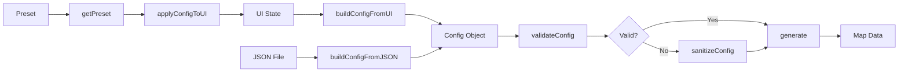

# Configuration System Integration Guide

This document explains how to integrate the new configuration system into the Fantasy Map Generator codebase.

## Overview

The configuration system provides a unified interface between the UI layer and the headless generation engine. It consists of four main components:

1. **config-schema.md** - TypeScript interface definitions
2. **config-builder.js** - Functions to build config from UI state
3. **config-presets.js** - Predefined configuration templates
4. **config-validator.js** - Validation and sanitization functions

## Integration Steps

### 1. Engine Integration

The engine already expects a config object in `src/engine/main.js`:

```javascript
import { generate } from './engine/main.js';
import { buildConfigFromUI } from './viewer/config-builder.js';
import { validateConfig } from './viewer/config-validator.js';

// Generate map from current UI state
async function generateMap() {
  // Build config from UI
  const config = buildConfigFromUI();
  
  // Validate configuration
  const validation = validateConfig(config);
  if (!validation.valid) {
    console.error('Configuration errors:', validation.errors);
    // Handle errors or auto-fix
  }
  
  // Generate map
  const mapData = generate(config);
  return mapData;
}
```

### 2. UI Integration

Update the viewer's main.js to use the configuration system:

```javascript
// src/viewer/main.js
import { 
  buildConfigFromUI, 
  applyConfigToUI,
  buildConfigFromJSON,
  saveConfigToJSON 
} from './config-builder.js';
import { getPreset } from './config-presets.js';
import { validateAndFix } from './config-validator.js';

// Generate button handler
document.getElementById('generateButton').addEventListener('click', () => {
  const config = buildConfigFromUI();
  const { fixed, validationResult } = validateAndFix(config);
  
  if (!validationResult.valid) {
    showValidationErrors(validationResult);
    return;
  }
  
  // Call engine with validated config
  const mapData = window.FMG.generate(fixed);
  renderMap(mapData);
});

// Preset selector handler
document.getElementById('presetSelector').addEventListener('change', (e) => {
  const presetName = e.target.value;
  const preset = getPreset(presetName);
  
  if (preset) {
    applyConfigToUI(preset);
  }
});
```

### 3. Headless/CLI Integration

For command-line usage:

```javascript
// cli.js
import { generate } from './src/engine/main.js';
import { getPreset } from './src/viewer/config-presets.js';
import { validateConfig, sanitizeConfig } from './src/viewer/config-validator.js';
import fs from 'fs';

// Load config from file
function loadConfig(filepath) {
  const jsonString = fs.readFileSync(filepath, 'utf8');
  return JSON.parse(jsonString);
}

// Generate from CLI
async function generateFromCLI(options) {
  let config;
  
  if (options.preset) {
    config = getPreset(options.preset);
  } else if (options.config) {
    config = loadConfig(options.config);
  } else {
    config = getPreset('default');
  }
  
  // Override with CLI arguments
  if (options.seed) config.seed = options.seed;
  if (options.width) config.graph.width = parseInt(options.width);
  if (options.height) config.graph.height = parseInt(options.height);
  
  // Validate and fix
  const validation = validateConfig(config);
  if (!validation.valid) {
    console.warn('Config validation warnings:', validation.warnings);
    config = sanitizeConfig(config);
  }
  
  // Generate
  const mapData = generate(config);
  
  // Save output
  fs.writeFileSync(options.output || 'map.json', JSON.stringify(mapData));
}
```

### 4. Save/Load Integration

Implement configuration persistence:

```javascript
// Save current configuration
function saveConfiguration() {
  const config = buildConfigFromUI();
  const jsonString = saveConfigToJSON(config);
  
  // Save to localStorage
  localStorage.setItem('fmg-last-config', jsonString);
  
  // Or download as file
  downloadJSON(jsonString, 'map-config.json');
}

// Load saved configuration
function loadConfiguration(jsonString) {
  const config = buildConfigFromJSON(jsonString);
  
  if (config) {
    const { fixed, validationResult } = validateAndFix(config);
    
    if (validationResult.warnings.length > 0) {
      console.warn('Configuration warnings:', validationResult.warnings);
    }
    
    applyConfigToUI(fixed);
  }
}

// Auto-save on generation
function generateWithAutoSave() {
  const config = buildConfigFromUI();
  localStorage.setItem('fmg-last-config', saveConfigToJSON(config));
  
  const mapData = generate(config);
  return mapData;
}
```

### 5. Testing Integration

Create tests for the configuration system:

```javascript
// config.test.js
import { validateConfig, sanitizeConfig } from './config-validator.js';
import { getPreset } from './config-presets.js';
import { buildConfigFromUI } from './config-builder.js';

describe('Configuration System', () => {
  test('All presets should be valid', () => {
    const presetNames = ['default', 'continents', 'archipelago', 'fantasy'];
    
    presetNames.forEach(name => {
      const preset = getPreset(name);
      const validation = validateConfig(preset);
      expect(validation.valid).toBe(true);
    });
  });
  
  test('Invalid config should be fixable', () => {
    const badConfig = {
      graph: {
        width: -100,  // Invalid
        height: 'abc' // Invalid
      }
    };
    
    const fixed = sanitizeConfig(badConfig);
    const validation = validateConfig(fixed);
    expect(validation.valid).toBe(true);
  });
  
  test('Config builder should produce valid config', () => {
    // Mock DOM
    document.body.innerHTML = `
      <input id="mapWidth" value="1920" />
      <input id="mapHeight" value="1080" />
      <input id="templateInput" value="continents" />
    `;
    
    const config = buildConfigFromUI();
    const validation = validateConfig(config);
    expect(validation.valid).toBe(true);
  });
});
```

## Migration Checklist

### Phase 1: Setup
- [ ] Copy configuration files to project
- [ ] Import configuration modules in viewer/main.js
- [ ] Add preset selector to UI

### Phase 2: Integration
- [ ] Update generate button handler to use buildConfigFromUI()
- [ ] Add validation error display
- [ ] Implement preset loading in UI
- [ ] Add configuration save/load buttons

### Phase 3: Testing
- [ ] Test all presets generate valid maps
- [ ] Test configuration persistence
- [ ] Test validation and auto-fix
- [ ] Test CLI integration

### Phase 4: Cleanup
- [ ] Remove old configuration code
- [ ] Update documentation
- [ ] Add configuration examples

## API Reference

### config-builder.js

```javascript
// Build config from current UI state
buildConfigFromUI(): Object

// Build config from preset with UI overrides
buildConfigFromPreset(preset: Object): Object

// Parse config from JSON string
buildConfigFromJSON(jsonString: string): Object

// Serialize config to JSON
saveConfigToJSON(config: Object): string

// Apply config values to UI elements
applyConfigToUI(config: Object): void
```

### config-presets.js

```javascript
// Get preset by name
getPreset(name: string): Object | null

// Get all preset names
getPresetNames(): string[]

// Get preset descriptions
getPresetDescriptions(): Object
```

### config-validator.js

```javascript
// Validate configuration
validateConfig(config: Object): ValidationResult

// Fix invalid configuration
sanitizeConfig(config: Object): Object

// Validate and auto-fix
validateAndFix(config: Object): Object

// Get human-readable report
getValidationReport(result: ValidationResult): string
```

## Configuration Flow



## Common Use Cases

### 1. Generate with Current UI Settings
```javascript
const config = buildConfigFromUI();
const mapData = generate(config);
```

### 2. Generate with Preset
```javascript
const config = getPreset('fantasy');
const mapData = generate(config);
```

### 3. Generate with Custom Config
```javascript
const config = {
  ...getPreset('default'),
  cultures: {
    ...getPreset('default').cultures,
    culturesInput: 25
  }
};
const mapData = generate(config);
```

### 4. Save and Restore Session
```javascript
// Save
const config = buildConfigFromUI();
localStorage.setItem('session', saveConfigToJSON(config));

// Restore
const saved = localStorage.getItem('session');
if (saved) {
  const config = buildConfigFromJSON(saved);
  applyConfigToUI(config);
}
```

## Troubleshooting

### Configuration Not Valid
- Check the validation report for specific errors
- Use sanitizeConfig() to auto-fix common issues
- Verify all required properties are present

### UI Not Updating
- Ensure DOM elements have correct IDs
- Check that applyConfigToUI() is called after DOM is ready
- Verify config object structure matches schema

### Preset Not Loading
- Confirm preset name exists in config-presets.js
- Check for JavaScript errors in console
- Validate preset configuration structure

## Best Practices

1. **Always validate** configuration before using it
2. **Use presets** as starting points for custom configurations
3. **Save configurations** with generated maps for reproducibility
4. **Document custom properties** if extending the schema
5. **Test configurations** across different map sizes and settings
6. **Handle validation errors** gracefully in the UI
7. **Version configurations** when making breaking changes

## Future Enhancements

- Configuration versioning and migration
- Advanced validation rules
- Configuration diff and merge tools
- Visual configuration builder
- Configuration sharing and community presets
- Performance profiling per configuration
- A/B testing framework for configurations